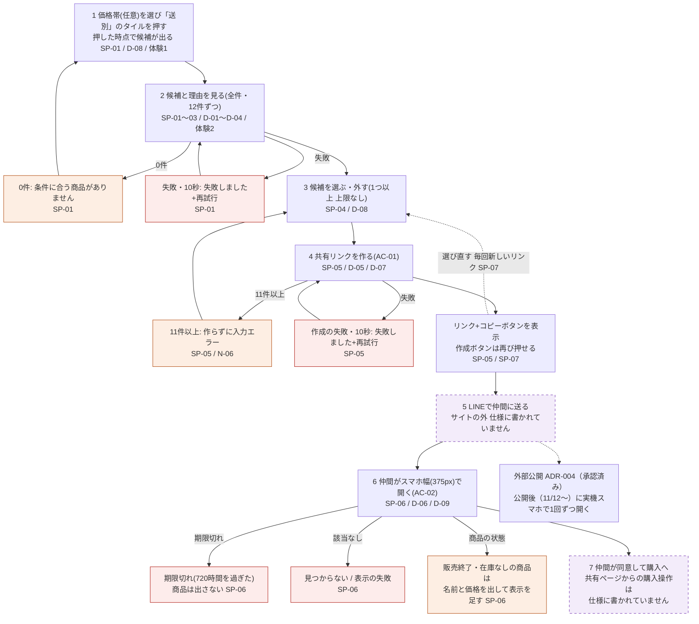
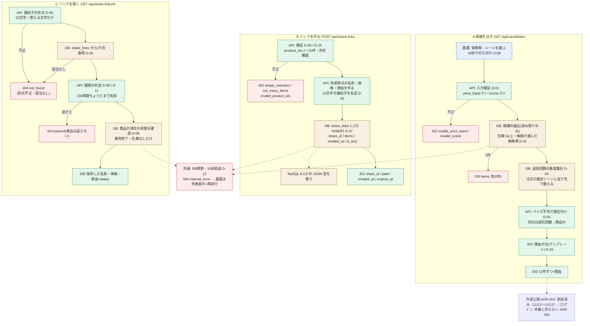
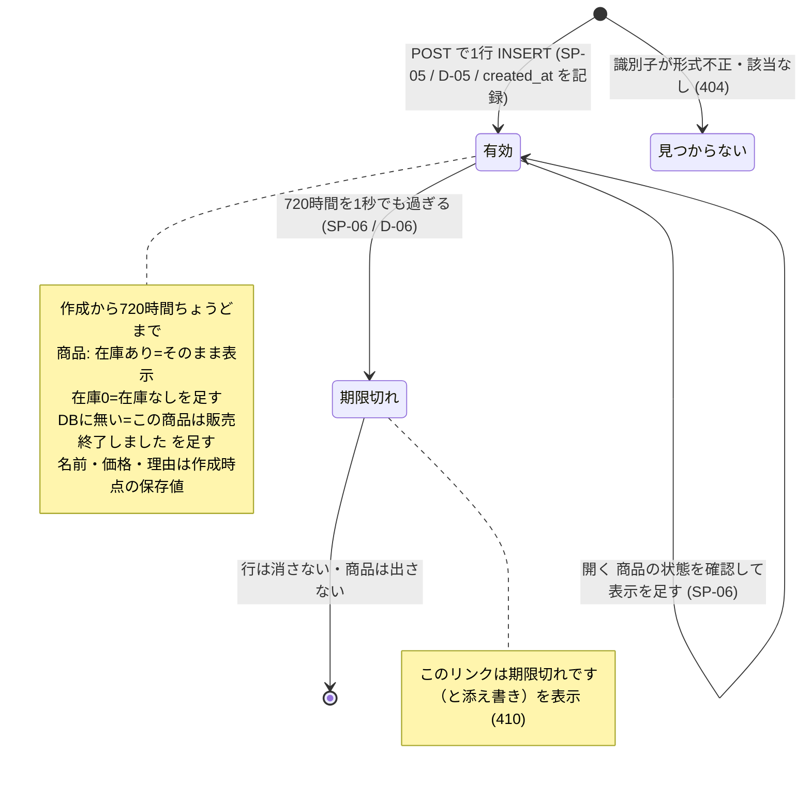

# 仕様 — Giftia UI/UX リニューアル

R-01（共同購入者）の導線から書く（ADR-002）。決定の根拠は `inputs/キックオフ記録.md` #22〜29。

## 主要導線

| 仕様ID | 要件ID | 利用者の操作 | UI状態 | API | データの変化 | 期待結果 |
| --- | --- | --- | --- | --- | --- | --- |
| 2026-11-16 | SP-31（要求 AC-21） | 最初のカードの上端は「250px 前後（200〜300px）」 | 「300px 以下なら合格（250px 前後が目安）」。テスト設計 S-90・A-21（PR #379）と言い回しをそろえるだけ | テスト設計の判定と食い違っていたため | PM 11/16「A」（PR #379 のコメント） |
| SP-01 | F-01, F-01a | 価格帯（任意。「〜2,999円／3,000〜4,999円／5,000円〜」の3つのボタンから1つ。#49-1・2）とシーン（お礼・誕生日・送別の3つのタイルから1つ）を選ぶ。シーンを押した時点で候補が出る（「候補を出す」ボタンは置かない。#50-1）。シーンを選んだあとに価格帯を押したら、その場で出し直す（#51-1） | 初期 / 検索中 / 結果あり / 0件 / 失敗 | 設計.md 参照 | なし（読み取りのみ） | 選んだシーンのタグを持ち、（カテゴリーも選んでいれば、選んだカテゴリーのどれかで、）在庫が1以上で、価格が選んだ価格帯に入る（税込。〜2,999円は2,999円以下、3,000〜4,999円はその間、5,000円〜は5,000円以上。両端を含む）商品を、全件、12件ずつ（R-02 と同じページ送り）おすすめ順（SP-02）に表示する（#49-1。PM 決定 2026-11-17（レージ、りじちょー代筆）「1A」。以前の「上位10件」は取り消し。並びは SP-21 で選べる）。価格帯は任意で、選ばなければ、シーンと在庫だけで絞り、価格では絞らない（並べ方・理由の文は同じ。#49-3）。同じボタンをもう一度押すと選択が外れる（#49-3）。ボタンの文字は「3,000〜4,999円」（#49-2）。API に範囲外の値（価格帯・シーン）が直接届いたら入力エラーで返す（#49-5）。`price_band=` が空で届いたら価格帯なしとして扱う。`budget` は読まずに無視し、エラーにしない（#51-4） |
| SP-02 | F-01a | （順位付け） | — | — | — | 件数の割り引きつき評価（ベイズ平均）の高い順。点数 ＝ (v ÷ (v＋20)) × R ＋ (20 ÷ (v＋20)) × C。R は商品の評価、v はレビュー件数、C は SP-01 で絞り込んだ候補のうち評価があり件数1以上の商品の平均評価（#37-5）。評価・件数のどちらかが無い商品は v＝0（点数＝C）。全候補に評価が無ければ全員同点。同点は職場の送別での回数が多い順、次に商品ID順（数字の大きさの順。#30 B）。第2弾: 同点の並びに使う回数は、選んだシーンの回数（SP-16 の数え方。送別は今のまま）にそろえる（PM 11/14「並びも変えましょう」）。回数が効くのは点数が同点の商品の並びだけで、点数が違う商品の順は変わらない（第3弾で全件を出すので、以前の「10位と同点の商品を10件目に入れるか」は無くなった）（Terao 確認 2026-11-14。お礼・誕生日×3価格帯の9例で、10件の顔ぶれも順番も変わらなかった。カテゴリーあり・価格帯なしは未確認） |
| SP-03 | F-02 | 候補を見る | 結果あり | SP-01 に含む | なし | 各候補に、理由を自然な文で表示する。事実をテンプレートでつなげる（AI は使わない）。値のある材料の文だけを順につなげ、値の無い材料は文に入れない。「と高めです」は評価4.5以上のときだけ（高評価バッジと同じ基準）。「評価も」は「〜選ばれていて、」とつなぐときだけ使い、それ以外は「評価は」で始める。評価があっても件数0なら評価の文を入れない。ラッピング不可と値なしは、どちらも文に入れない（#32-2〜4）。例: 「職場の送別で48回選ばれていて、評価も4.6（120件）と高めです。2日で届き、ラッピングもできます。」／「職場の送別で12回選ばれています。評価は4.2（30件）です。3日で届きます。」／送別回数0「職場の送別での購入は、まだありません。評価は4.0（8件）です。2日で届きます。」（#30 A・E）。第2弾: 回数の文は選んだシーンに合わせる（P-1・U-6。F-23。数え方は SP-16。数え方は SP-16。文の頭は、送別「職場の送別で」、お礼「お礼で」、誕生日「誕生日で」。回数が0のときは回数の文を出さず、評価の文から始める（#29-11・#30 A・E の「…での購入は、まだありません。」を第2弾で取りやめ。PM 11/15「1-3/5おすすめ通りで」 R12。P-1「回数0は出さない」とそろえる）。共有リンクに保存済みの第1弾の文は変えない。回数 0 で評価・配送日数・ラッピングも無く理由の文が空になるときは、理由の行ごと出さない（新しい文言は作らない。確定 PM 11/15 朝「理由の行を出さない」）。これから作る共有リンクに保存する理由の文は、作る時に選んでいたシーンに合わせる（確定 PM 11/15 朝「シーンに合わせる」。設計 D-05）。シーンを選んでいないときは、シーンに触れない文にする（回数の文を入れず、評価・配送日数・ラッピングのうち値のある材料だけをつなぐ。例: 「評価は4.6（120件）と高めです。2日で届き、ラッピングもできます。」。型は設計 D-03「シーンを選んでいないときの文」の表。値の無い材料は文に入れない決まりはそのまま）。「シーンが無ければ送別」は取り消し（PM 決定 2026-11-17「1A」（レージ、りじちょー代筆））） |
| SP-04 | F-03, F-27 | 候補を選ぶ・外す（第2弾の文言: カードのボタン「共有リストに入れる」、押した後「✓ リストに入れた」。U-20。**シーンを選んでいなくても出す**: シーンなしの一覧（R-02）・トップのおすすめ・詳細でも同じ（F-47。PM 決定 2026-11-17「1A」（レージ、りじちょー代筆））。「共有リストに入れる」ボタンの右上に「？」を置き、押すと短い説明を出す（PM 2026-11-17「2c」。文言案: 「選んだ候補をリンクにして、LINE などで仲間に送れます。仲間は登録なしで見て、いいねで答えられます」）。**「？」の置き場所と形**（PM 決定 2026-11-17（#416 の答え））: 各カードの「共有リストに入れる」ボタンの右上に寄せて置く（丸は 16px、中の「？」の字は 12px。押せる範囲は透明な余白で縦横 44px 以上にする。ボタンやカードの枠からはみ出さない。PM 決定 2026-11-18「B」（レージ、りじちょー代筆。#437）。これまでの「ボタンの横・44px の丸」は取り消し）。押すとボタンのすぐ上にふきだしを小さく出し、外を押すかもう一度押すと消える（画面をふさがない）。**トップ**: おすすめで入れたら、トップにも下端の帯「共有リスト n件」を出す（1件以上のとき。押すと共有リストを開く。帯は「共有リスト n件」だけで、カートは並べない（カートはヘッダーにある）。スマホ（899px 以下）は検索結果の帯 SP-29 と同じ開き方、PC（900px 以上）は右から出るパネルで共有リストを開く（SP-09 の詳細のパネルと同じ形）（PM に報告済みの、今の決まりを延ばした決め。2026-11-17））。**詳細の欄**にも「共有リストに入れる」を置く（「カートに入れる」の上。共有ページから開いた詳細には置かない）） | 選択中の数を表示 | なし（画面内） | 画面内の選択だけ | 1つ以上、上限なしで選べる |
| SP-05 | F-04, F-27, F-38 | 選んだ候補で共有リンクを作る（第2弾の文言: 欄の見出し「共有リスト」、作成ボタン「共有リストを作る」。U-20。作られるものは今どおり共有リンク） | 作成中 / 成功 / 失敗 | 設計.md 参照 | 共有リンクを1件作る（作成時点の商品名・価格・理由を保存） | 1つ以上10件以下を選んでいれば、サイトを閉じずにリンクが作られる。11件以上なら作らずに入力エラー（N-06）。11件以上を選んでいる間は、作成ボタンのすぐ上に「共有リンクに入れられるのは10件までです。選ぶ数を減らしてください」と出し、ボタンを押せない（選択数はそのまま表示）。同じ商品IDが重なって届いたら1件にまとめ、エラーにしない（#36）。選択0件は「選んだ候補」の欄も作成ボタンも出さない（#76）。作成中は作成ボタンを押せない。識別子は推測できない22文字のランダム文字列（英大文字・英小文字・数字・「-」「_」）。作成後はリンクとコピーボタンを表示し、作成ボタンは再び押せる状態に戻す（#30 I・K）。コピーボタンを押すとリンクをコピーし、ボタンの近くに「コピーしました」を2秒表示。失敗したら「コピーできませんでした。リンクを長押ししてコピーしてください」を、次にコピーボタンを押すまで表示したままにする（#32-6、#33）。共有リンクを作り直したら、画面には新しいリンクに置き換えて最新の1本だけ出す。前のリンクも期限（720時間）までは開ける（#41-1）。第2弾: 共有リンクの理由の文は、作る時に選んでいたシーンに合わせて保存する（結果の画面でシーンを選んでいるときだけ、画面が `scene` を送る。選んでいなければ `scene` を送らず、シーンに触れない文で保存する。選んだ候補のシーンが混ざる・無いときも送らない（シーンに触れない文で保存する。設計 D-05 と同じ言い方）（PM 決定 2026-11-17「1A」（レージ、りじちょー代筆））。SP-03。確定 PM 11/15 朝「シーンに合わせる」）。共有リストの欄は PC の幅では結果の右に固定、スマホの幅では下端の帯から開く（SP-29。U-5） |
| SP-06 | F-05, F-33, F-34 | 共有リンクを開く（ログインなし） | 読み込み中 / 表示 / 期限切れ / 見つからない | 設計.md 参照 | なし | 作成時点の商品名・価格・理由を表示する。ページの見出し（h1）は「贈りもの候補」（実装にそろえる。PM 決定 2026-11-18「直し案どおり」。モックの共有ページの見出しも直す）。販売終了と在庫なしだけは開いた時点で確かめる（商品が DB に無ければ「この商品は販売終了しました」、在庫0なら「在庫なし」。作成時点の商品名・価格は出したまま、この表示を足す。#32-5）。見出し（h1）の下・商品の一覧の上に、固定の案内文「プレゼントの候補を選びました。よいと思うものに『いいね』を押してください。」を 1 つ（字は 16px・太字。PM 決定 11/18）、「表示」のときだけ出す（読み込み中・期限切れ・見つからない・失敗では出さない。保存しない。作成者が選ぶ欄は作らない。PM 決定 11/18）。いいねボタンのマークは指定の画像（`like-akabu.gif`。PM 決定 11/18）。「いいね」の文字を残し、読み上げは `aria-label`＝「いいね」と `aria-pressed`、画像の alt は「いいね」。押した状態は枠の色が変わる。いいねの数だけ、同じ画像をボタンのすぐ横に並べる（5 個まで。6 個目からは「＋N」。N は 5 を超えた分。並んだ画像は飾りで読み上げず、数は文字で読める。動きを減らす設定では静止画）。**共有ページの上で開く詳細パネルのいいねも同じ**（ハートをやめて同じ画像・同じ並び・同じ読み上げ。共有一覧のボタンと同じ部品。PM 決定 11/18 1B）。**画像の大きさは、ボタンの中 28px・並べる分 32px**（PM 決定 11/18 2A）。**幅が足りないとき（375px で 5 個以上など）は次の行に折り返す**（PM 決定 11/18 3A）。API・DB・計測は変えない。他の画面のハート（検索結果・お気に入り）は変えない。「このページはリンクを知っている人なら誰でも見られます」の注記を、商品の一覧のすぐ下に、「表示」のときだけ出す（#54-7）。作成から720時間ちょうどまでは表示し、1秒でも過ぎたら（サーバー時刻）商品は出さず「このリンクは期限切れです」を表示（添え書きと「ほかの贈りものも探す」は、この仕様.md の共有ページの行のとおり）。スマホ 375px・PC 1280px で崩れない（#30 G・H）。第2弾: 各商品に画像（カテゴリー共通の色の面（小さく「イメージ」）。`category` で選び、`category` が無い販売終了の候補には画像を出さない。D-06。決定（PM 11/15 #295「Aで」））と「くわしく見る」（押すと、検索画面へ移らず、共有ページの上で詳細を開く。URL は共有ページのまま。詳細を閉じると、共有ページの同じスクロール位置に戻る。開いた詳細は SP-12 の「共有ページから開く詳細」のとおり。PM 11/17 #410 決定1。販売終了の候補（商品が無い）には置かない。PM 11/15 K-6）、一覧の下に「ほかの贈りものも探す」（トップへ）、各商品にいいね（SP-28）。カートのボタンは置かない（G2。共有ページの上で開いた詳細にも出さない。SP-12）。作成時点の商品名・価格・理由の表示は今どおり（U-16・L。F-33・F-34） |
| SP-07 | F-04 | 選び直す・同じ選び方でもう一度作る | — | — | 新しい共有リンクを作る | 作成済みのリンクの中身は変えない。同じ選び方でも毎回新しいリンクを作る |
| SP-08 | F-10, F-35 | どの画面でもヘッダーを見る・使う | 共通 | なし | なし | ロゴ・検索欄・お気に入り・ログイン・カートの順に並べる。トップ・検索結果・共有ページで同じ。スマホの幅（480px 以下）のヘッダーは 1 段: ロゴを左、右に虫めがね（検索。SP-35）・お気に入り・ログイン・カートの 4 つ（PM 11/15 の決定。虫めがねを足す）。各ボタンはアイコン（24px）の下に 10px の文字（「お気に入り」「ログイン」「カート」）、カートの数の丸はアイコンの右上。ログインの「準備中」は、文字の代わりに小さい札で出すかアイコンを薄くする（読み上げの名前は今のまま）。押せる大きさは 44px 以上。PC の幅は変えない（PM 11/15。これまでの 2 段の決め #60-2 を置き換える）。ロゴを押すとトップへ（第2弾: ロゴはアイコン A＋「Giftia」の文字。SP-19。PM 11/15）。検索欄は入力欄で、中に薄い字で「商品名や「甘いもの」で探す」（PM 11/15。#41-8 の「準備中」と #46-7 の「中身は今回作らない」は取り消し。SP-35）。ログインは「準備中」（押しても何も起きない。本番には作らない。#65）。お気に入りを押すと SP-13、カートを押すと SP-14 を開く。カートの数は、入っている商品の種類の数（数量の合計ではない。同じ商品を2個でも「1」）（2026-11-14 PM 決定、#250）。「取引先へのお礼」「ギフトを探す」「カートに入れる」は置かない（#45-7、AC-03）。第2弾: スマホの幅ではヘッダーに検索欄そのものは出さず、虫めがねのアイコンを出す（SP-35。PM 11/15 の決定）。PC の検索欄は SP-35 で動く入力欄にする（「準備中」と「中身は今回作らない」は外す。#46-7 の取り消し。PM 11/15）。**幅とそろえ**: トップと検索結果の本文の最大幅は 1200px。ヘッダーの中身も 1200px で中央寄せにする（左右の余白は max(16px, (100% − 1200px) ÷ 2)）。1280px ではロゴと本文の左端がどちらも 40px、480px 以下は 16px（PM 決定 11/17。#273 1A。実装 #407。トップの幅 1100px は 1200px に変えた）。**固定**: ヘッダーはすべての幅（PC・タブレット・スマホ）で常に画面の上に固定し、スクロールしても上に残る（PM 決定 2026-11-17「1A」（レージ、りじちょー代筆））。固定したヘッダーの下に本文が隠れない（ページの先頭の見え方は今と同じ。スクロールしたあと、詳細の欄・右の列・フォーカスした部品がヘッダーの下に入らない）。カート・お気に入りのパネルと詳細のシート・暗幕はヘッダーより手前に出す（SP-18・SP-29 のとおり） |
| SP-09 | F-11, F-12, F-29, F-30 | トップを開く。シーンのタイル・価格帯ボタン・カテゴリーのタイルを押す | 初期 | なし（トップの表示だけ）。おすすめは SP-10 の API | なし | 上から順に、ヒーロー、ヒーローの下に、シーンのタイル3つと価格帯のボタン3つを1組で並べ、「シーンから探す」「予算から探す」はその組の見出しにする（#55-5）。「シーンから探す」（お礼・誕生日・送別の3タイル。「取引先へのお礼」は置かない。#50-6。「候補を出す」ボタンは置かない。#50-1）、「予算から探す」（〜2,999円・3,000〜4,999円・5,000円〜 の3ボタン。OPEN-03。案A の画像の「3,000〜5,000円」は使わない。#49-2）、「カテゴリーから探す」（10個のアイコン付きタイル。スマホの幅（480px 以下）では、最初から4つを出し、その下の「ほか6個を見る」を押すと残りの6個が開く（第2弾 T で #61-1 の「最初は閉じている」を変更。F-30。4つは注文の多い順の上位4つ＝食品・飲料・生活雑貨・フラワー。T-1、Terao 調べ 2026-11-14）。10個の並びはトップ・検索結果、PC・スマホで共通（T-5。#54-5 の並びを変更）。検索結果の画面のカテゴリーとパソコンの幅は変えない（#61-2・3）。開閉のボタンはキーボードで操作でき（Tab で届き、Enter・Space で開閉）、開閉の状態を読み上げに伝える（`aria-expanded`。#61）。食品・飲料・生活雑貨・フラワー・コスメ・酒類・インテリア・家電・ビジネス小物・カタログギフト。#54-5）、「おすすめの商品」（おすすめ順の上位4件を4列に並べる。#53-1。画像と商品名のどちらを押しても、検索結果の画面へは移らず、トップの上でその商品の詳細を開く（PM 決定 2026-11-17「3D」（レージ、りじちょー代筆）。#46-2・PM 11/15 の「検索結果の画面で開く」を置き換える。理由: 条件なしで検索結果へ移ると、見出し「絞り込み結果」と関係ない全商品の一覧が出て分かりにくいため）。閉じるとトップの同じスクロール位置に戻る。スマホの幅（899px 以下）は SP-29 の下から出るシートで開く。PC の幅（900px 以上）は、右から出るパネルで開く（お気に入り・カートのパネルと同じ形。PM 決定 2026-11-17「4A」（レージ、りじちょー代筆）。暗幕・閉じるボタン・Esc・フォーカスの戻し先は SP-18 のパネルと同じ。共有ページの詳細も同じ形）。詳細の中身と主ボタンは SP-12 の今のまま）。シーンのタイルを押すと検索結果へ移り、その場で R-01 の候補の1ページ目（12件。SP-15。価格帯を選んでいればその価格帯で）を出す（SRC-03。#50-1、#51-1・2）。トップではシーンのタイルを押すと検索結果へ移る。価格帯は先に選んでおけ（そのあとシーンのタイルを押すと、その価格帯で候補を出す）、あとから検索結果でも選べる。トップに「シーンを選んだまま」の状態は作らない（#51-1。PM 決定 2026-11-18「直し案どおり」）。カテゴリーのタイルは押すと、そのカテゴリー1つを選んだ状態で検索結果へ移る。2つ目からは検索結果の画面で足す（#58-4）。シーンが無ければ R-02 の12件ずつ（おすすめ順）、シーンも選んでいれば R-01 の候補をそのカテゴリーで絞って出す（#54-5、#56-1）。検索結果の文字ボタンをもう一度押すと外す（トップのカテゴリーのタイルは、押すと検索結果へ移る。#56-1）。トップの見出しは「カテゴリーから探す」だけ（「（複数選べます）」は検索結果の画面だけ。トップは1つ選んで移る。#58-4。PM 11/15）。価格は R-01（SP-01）も R-02（SP-10）も価格帯の3ボタン（#48・#49-1。#45-2 の自由入力は取り消し）。トップでシーンが未選択のまま価格帯だけを選んだら、価格帯ボタンの下に「この価格帯の商品を見る」のリンクを出し、押すと R-02 の12件ずつ（おすすめ順）に進む。シーンも選んでいるとき、価格帯を外したときは出さない（#54-8）（#53-3）。スマホの幅（480px 以下）だけ、商品までのスクロールを減らすため、価格帯の下の説明は 1 行「価格は税込。もう一度押すと解除します。」にし、シーンの札の高さは 48px（押せる高さ 44px 以上は保つ）、見出しの上下の余白は 22/10px → 16/8px に詰める（Mi-rin の実測 #349。PM 11/15）。PC・タブレットの幅は変えない。PC の幅では、価格帯の下に説明を 2 つ出す: 「価格は税込です。選ばなければ価格では絞りません。もう一度押すと解除します。」と「シーンを押すと候補が出ます。価格帯は先に選んでも、あとから選んでもかまいません。」（モックの文。PM 決定 2026-11-18「直し案どおり」。実装は #240）。 |
| SP-10 | F-12, F-18, F-35, F-39, F-42 | 検索結果で、シーン・価格帯・カテゴリーを選ぶ。「条件をクリア」を押す | 検索中 / 結果あり / 0件 / 失敗 | 設計.md 参照（D-28） | なし（読み取りのみ） | 条件の並びは、1行目が見出し「シーン」と選択肢、続けて見出し「価格帯（税込）」と選択肢（同じ行。AC-05）、2行目が見出し「カテゴリー（複数選べます）」と文字だけのボタン（PM 判断 2026-11-14（#255）。見出しの文言はモックと同じ）。各条件は単一選択、条件間は AND（OPEN-02）。選ぶと検索ボタンなしで自動で検索し、結果を出し直す。選んだボタンは見て分かる状態にする。「条件を選ぶと自動で検索されます」を条件の下に常に出す。「条件をクリア」でシーン・価格帯・カテゴリーのすべてを外す。選んだ候補は残す（#50-2）。選んでいるボタンをもう一度押すと、その条件が外れる（#46-1）。結果は、シーンがあれば R-01 の候補（12件ずつ。SP-15。カテゴリーも選んでいれば、選んだカテゴリーのどれかに絞った10件。#55-1）、シーンが無く価格帯かカテゴリーがあれば R-02 の12件ずつ（おすすめ順）（#51-2、#54-5）。「条件をクリア」でカテゴリーも外れ、選んだ候補は残る（#55-3）。条件ボタンを押した時点で結果を出し直す（#50-1、#51-1）。キーワードは今回作らない（#46-7。PM 11/15 で取り消し。実装③で SP-35 として作る）。続けて条件を変えたら最新の条件の結果だけを残し、古い条件の応答は捨てる（AC-11）。カテゴリーの文字ボタンは10個（食品・飲料・生活雑貨・フラワー・コスメ・酒類・インテリア・家電・ビジネス小物・カタログギフト）。「準備中」は外す。押すたびに選ぶ・外すが切り替わり、ほかのカテゴリーは外さない。複数選べ、選んだどれかに当てはまる商品を出す（シーン・価格帯とは両方に合うもの）。選んでいるボタンには✓印を付け、色だけに頼らない。選べる数に上限はなく、10個全部は何も選ばないのと同じ（#57、#58-1・2・5）（#45-2〜4、AC-05・AC-06・AC-11）。第2弾: スマホの幅では条件の欄を1行にたたむ（SP-31）。シーンなしの結果に並び替え（SP-21）。0件のとき助け舟（SP-24）。カテゴリーの並びは T-5。言葉があるときは、0 件の文言を言葉のものにする（カテゴリー・価格帯・シーンの文言より先。SP-35 ⑥） |
| SP-11 | F-13, F-16, F-20, F-32, F-36, F-37 | 検索結果のカード・ページ送りを見る・押す | 結果あり | 設計.md 参照（D-28） | なし | 結果を12件ずつ、おすすめ順（SP-02 と同じ式の点数の高い順。絞り込んだ商品で C を求める。同点は商品ID順（数字の大きさの順）。#46-2、#50-3）に、カード型で並べる。在庫が0の商品は出さない。条件を付けないときは全商品をおすすめ順に12件ずつ（#46-3）。カードは画像（カテゴリー共通の色の面に小さく「イメージ」と表記）・商品名・価格（「4,000円（税込）」#41-9）・評価と件数（「★ 4.7（120件）」）・決め手の 1 行（SP-16。第2弾で、今の配送日数（「3日でお届け」）・ラッピング可をこの 1 行にまとめた。F-20）・お気に入りのハート（R-01 のカードにも、評価と件数を SP-15 のとおり同じに出す）。評価が4.5以上のカードには「高評価の商品」（SP-03 の高評価バッジと同じ基準）。評価・件数・配送日数・ラッピングのどれかが無い商品は、その項目だけ出さない（値を作らない。OPEN-06）。カードの画像と商品名のどちらを押しても SP-12（詳細の欄）を開く（画像は同じ行き先の商品名リンクと重なるので Tab の順に入れない）。ハートと「カートに入れる」は別のボタンで、押しても詳細は開かない（カード全体を 1 つのリンクにはしない。PM 11/15「画像と商品名を押せるようにする」）。下に「全n件中a〜b件を表示」とページ番号・次へ（案A）。ページ送りは同じ条件のまま次の12件に替える（#45-5・6）。範囲外のページ番号が来たら1ページ目を出す（#46-5）。第2弾: カードの下段に「カートに入れる」とハート（SP-30。スマホの幅ではハートは価格の行の右）、ページ番号を短くする（SP-32）、並び替え（SP-21）、検索中の表示の位置（SP-33）。カードの商品名は 2 行まで（はみ出す分は「…」。高さは 2 行分で固定。SP-30。PM 決定 11/18） |
| SP-12 | F-14, F-16, F-21, F-22, F-24, F-31, F-40, F-43 | カードを押して詳細を見る | 詳細の欄 | 設計.md 参照（D-29） | なし | カードの画像と商品名のどちらを押しても、検索結果の右に詳細の欄を出す（ハート・「カートに入れる」を押しても開かない。PM 11/15）。商品名・画像・価格（税込）・評価（件数）・「高評価の商品」・配送日数・ラッピング・商品の特徴・セット内容、「カートに入れる」と「お気に入りに追加」。ハートは SP-13、「カートに入れる」は SP-14 と同じ状態を見る。下端が切れたり重なったりしない（AC-08）。詳細の取得が通信の失敗なら、詳細の欄に「商品の情報を読み込めませんでした」と「もう一度」ボタンを出す。404 なら「この商品は見つかりません」（「もう一度」ボタンは付けない。#58-10）を出す（#55-4）。「商品の特徴」は商品の説明文、「セット内容」はサイズの列の値を出す。値が無ければ出さない（#45-6、#54-6）。在庫0の商品は詳細の欄に「在庫なし」と出す。詳細 API は在庫0でも404にせず、商品情報と在庫なしの状態を返す（#53-5）。第2弾: 商品名と価格のすぐ下に決め手の 1 行（SP-16。カードと同じ値・並び・文言）、その下に「贈った人の声」（SP-17）。在庫0の商品の「カートに入れる」は押せない（SP-18）。第2弾: スマホの幅では下から出るシートと固定帯、PC の幅では欄の下端に価格と「カートに入れる」の固定帯（SP-29。PM 11/15）。似た商品（SP-25）。詳細を開いたら最近見た商品に入れる（SP-22）。**トップのおすすめを押したとき**は、検索結果へ移らず、トップの上で同じ詳細を開く（SP-09。PM 決定 2026-11-17「3D」（レージ、りじちょー代筆））。**共有ページから開く詳細**（PM 11/17 #410 決定2）: 主ボタンは「いいね」（共有一覧のボタンと同じ画像・同じ並び。SP-06。PM 決定 11/18 1B）で、「カートに入れる」は出さない（共有ページに購入操作を置かない 11/14 の決定とそろえる）。いいねの状態と数は、共有ページのカード（SP-28）と同じものを見る（詳細で押すと、共有ページのカードの数も変わる）。価格は固定帯に出す。検索画面から開く詳細は今のとおり（主ボタンは「カートに入れる」） |
| SP-13 | F-15, F-25, F-32, F-41 | カード・詳細のハート、またはヘッダーのお気に入りを押す | 登録済み / 未登録 | なし（ブラウザ内保存、D-10） | ブラウザ内の保存だけ | ハートで登録・解除。お気に入りの一覧（ヘッダーから開く。右から出るパネル。#46-6）と、カード・詳細のハートの状態は同じ。同じ商品は重複しない。再読込後も残る。保存が使えない環境でも画面は壊れない（#45-7、AC-09）。第2弾: パネルの各行に「カートに入れる」と詳細への道（SP-18）。第2弾: R-01 のカードとおすすめのカードにもハート（SP-30。SP-13 は R-01 のカードを外していないので、仕様どおりに直す扱い）。お気に入りで比べる（SP-23） |
| SP-14 | F-17, F-26, F-44 | 「カートに入れる」・ヘッダーのカートを押す | カートの中身 | なし（ブラウザ内保存、D-10） | ブラウザ内の保存だけ | 追加すると数量1（同じ商品は数量+1）。カートの中で数量変更・削除・合計（税込）。カートは右から出るパネルで開く。数量は1〜99。直接入力でき、100以上を入れたら99に直す（#50-5、#51-3）。数量の欄に空・小数・数字以外を入れたら、欄を離れた時点で直前の数量に戻す。0以下は1にする（#53-4）。全角の数字は半角に直して受け付ける（#54-9）。全角と半角が混ざった入力（「１2」）も全部半角に直して受け付ける。全角の小数点（「１．５」）は小数として、直前の数量に戻す（#56-3）。カートを開くとき、保存した商品ごとに詳細（SP-12 と同じ情報）で確かめ、販売終了は「販売終了」、在庫0は「在庫なし」と出し、どちらも合計に入れない（#50-4、#53-5）。「注文へ進む」を押すと「デモのため、注文はできません」（#26・#27、#45-7、#46-6）。以下（2026-11-14 PM 決定、#250）: ①数量の欄の両側に＋／−ボタンを置き、1ずつ増減する。数量が1のとき−、99のとき＋は押せない。直接入力もそのまま使える。②商品の情報の確認が通信の失敗（404 以外）で終わったら、その商品に「商品の情報を読み込めませんでした」と「もう一度読み込む」ボタンを出す。押すとその商品だけ確かめ直す。確かめられるまで合計に入れない。③「カートに入れる」を押したら「カートに入れました」の通知を約3秒出し、通知の中の「カートを見る」でカートのパネルを開ける（マウスやフォーカスが通知にある間は消さない）。パネルは自動では開かない。④保存したカートが読めない（壊れている）ときは空のカートとして保存し直し、「カートを読み込めなかったため、空にしました」を1回だけ出す。第2弾: 「注文へ進む」の押せる条件、行の画像と詳細への道、「買い物を続ける」（SP-18）。第2弾: 各行に届く日（目安。SP-26） |
| SP-15 | F-19, F-20, F-27, F-32 | トップまたは検索結果でシーンを選ぶ（価格帯は任意） | 結果あり / 0件 / 失敗（SP-01 のとおり） | SP-01 のとおり | なし | 検索結果の画面に、R-01 の全件を12件ずつ（R-02 と同じ形。「全n件中a〜b件を表示」とページ番号。PM 決定 2026-11-17（レージ、りじちょー代筆）「1A」）おすすめ順で出す。並びを選ぶ部品も付く（SP-21）。順位の番号（1位・2位…）は出さない（3C）。カードは SP-11 と同じ枠に（R-01 のカードにも評価と件数を SP-11 と同じに出す（「★ 4.7（120件）」。高評価の商品の札も同じ基準）。理由の文にも入る。PM 決定 2026-11-18「案ア（モックにそろえる）」。API の応答に評価・件数を足す（設計 D-01。#459）・カードに出す（#461）の実装は済み）、理由の文（SP-03）・「共有リストに入れる」（第2弾で「選ぶ」から変更。U-20・F-27）・決め手の 1 行（SP-16）を足す。右に詳細の欄（SP-12）。SP-04（選ぶ・外す）・SP-05（共有リンクを作る）は、この画面の「選んだ候補」の欄で行う。R-01 の候補が出るのはシーンがあるときだけ。シーンとカテゴリーを両方選んだら、R-01 の候補も選んだカテゴリーのどれかに当てはまる商品に絞ってから並べる（#55-1、#58-6）。シーンが無く価格帯だけなら R-02 の12件（SP-10）に切り替わり、選んだ候補は残す（#51-2）（#45-1・5・6）。第2弾: カードに「カートに入れる」とハート（SP-30）。カードの商品名は 2 行まで（はみ出す分は「…」。高さは 2 行分で固定。SP-30。PM 決定 11/18） |
| SP-16 | F-20, F-21, F-23 | 検索結果のカードを見る。詳細を開く | 結果あり / 詳細の欄 | 設計.md 参照（D-01・D-28・D-29・D-34） | なし（読み取りのみ） | **決め手の 1 行**（第2弾 P）。並びと文言（PR で PM が確かめる）: ①「{箱の線の SVG} {M}/{D}までに届く（目安）」（`delivery_days` が値ありのとき。日付は SP-26） ②「{リボンの線の SVG} ラッピング可」（`gift_wrap`＝1 のとき。不可と値なしは出さない。SP-03 と同じ） ③「在庫あり」（`stock` が1以上のとき。G9。在庫なし（0）は今どおり詳細の「在庫なし」（SP-12）で、決め手には出さない） ④「{シーン}で{n}回」（シーンを選んでいて、回数 n が1以上のとき。0 は出さない）。アイコンは線の SVG（📦 の代わりに箱、🎀 の代わりにリボン）で、飾りなので読み上げさせず、意味は文字で伝える。値の無い決め手は出さない（値を作らない。OPEN-06）。カード（SP-11・SP-15）と詳細（SP-12）で、同じ商品なら同じ値・並び・文言。**回数の数え方**: 送別＝推定シーン「送別」かつ会社宛て（今の D-04 と同じ）、お礼＝「ビジネスのお礼」、誕生日＝「友人への誕生日」と「家族への誕生日」の合計。「毎年決まった相手への贈答」は数えない（確定。PM 11/14「回数は案通り」）。シーンを選んでいない画面（R-02 の一覧、トップのおすすめから開いた詳細）では④を出さない（P-1「選んだシーンに合わせて出す」）。トップのおすすめのカード（SP-30）にも同じ1行を出す |
| SP-17 | F-22 | 詳細を開く | 詳細の欄 | 設計.md 参照（D-29・D-35） | なし（読み取りのみ） | **贈った人の声**（第2弾 P。欄の名前は決定 2026-11-13）。選び方: その商品の `reviews` のうち、`rating` が4以上、`comment` が NULL でなく空白だけでもない行を、`posted_at` の新しい順（同じ日は本文の文字の順）に並べ、本文が同じ行は1件にまとめ（大文字小文字・末尾の空白の違いは同じとみなす。DB の照合順序の動き）、最大2件。0件なら欄ごと出さない（見出しも出さない）。出すのは本文（「」で囲む）と星（「★5」）だけ。投稿した人の ID・名前・投稿日は出さない（N-13）。長い文は切らずに全文を出す（PR で PM が確かめる）。架空データには商品とシーンが合わない声がある（例: ハンドクリームに「出産祝いに」）が、今回は除かない（ADR-008）。置き場所は詳細の欄の決め手（SP-16）のすぐ下 |
| SP-18 | F-24, F-25, F-26 | 詳細・お気に入り・カートで「カートに入れる」「注文へ進む」を押す。行の商品名を押す | 詳細の欄 / お気に入りのパネル / カートのパネル | 設計.md 参照（D-29・D-30・D-31） | ブラウザ内の保存だけ | **買う手前の行き止まりをなくす**（第2弾 U-12・14・15）。①詳細（U-14）: 在庫0（`status`＝`out_of_stock`）の商品は、「カートに入れる」を「在庫なし」の文字にして押せなくする。②お気に入りのパネル（U-12）: 各行に「カートに入れる」（SP-14 の追加と同じ動き。通知も同じ）を置く。在庫0は①と同じく押せない。「この商品は見つかりません」（404）の行には置かない。行の商品名を押すと、パネルを閉じて検索結果の詳細の欄でその商品を開く（`/search?product=…`。SP-09 のおすすめと同じ開き方）。おすすめ・お気に入り・カートの商品名から開いた詳細（`/search?product=…`）を閉じると、検索結果（R-02 の一覧）が見える。元の画面・パネルには戻さない（PM 11/15「今のまま検索結果」）。③カートのパネル（U-15）: 買える商品（販売終了・在庫なし・読めない商品を除いた商品）が0件のとき、「注文へ進む」を押せなくし、ボタンのすぐ上に「買える商品がありません」と出す（空のカートも0件）。パネルを開いた直後、在庫の確認が終わるまでは「買えない」と決めない: 「買える商品がありません」は出さず、「注文へ進む」は押せない（文言は出さない。確定 PM 11/15「確認中は何も出さない」）。確認が終わって1件以上なら今どおり押せて「デモのため、注文はできません」。各行に小さい画像（カテゴリー共通の色の面（小さく「イメージ」））と、商品名から②と同じ開き方で詳細を開く道を置く（販売終了の行は商品が無いので画像も道も置かない）。パネルの下に「買い物を続ける」を置き、押すとパネルを閉じて検索結果（`/search`）へ移る。すでに検索結果にいるときは閉じるだけで、条件は変えない。どのボタンも縦横44px 以上（N-12） |
| SP-19 | F-28 | ブラウザのタブを見る。共有リンクを LINE などに貼る | — | なし（固定のページ情報） | なし | **アイコンと OGP**（第2弾 U-21）。サイトのアイコン（favicon）を全ページに置く（絵柄は Mi-rin の案 A「オレンジの贈り物」。PM 11/14「アイコンは案Aで」）。プレビュー（OGP）はページごとに画像・タイトル・説明を出し分け、画像は2枚（PM 11/14「1で。分けることで進めて」。絵はどちらもヒーローの案 A。PM 11/14「案Aがいいですが、文字と絵が被ってるところが気になります」）。①共有ページ（`/s/…`）: 画像は「どれがいいと思う？／いいねで教えて。」の固定の1枚、説明「どれがいいと思う？いいねで教えて。」、タイトル「Giftia の贈りもの候補」（今どおり）。商品名・理由・価格は出さない（N-15）。noindex は今どおり（N-07）。②トップとその他のページ: 画像は今のサイトの見出し「ありがとうに、ちょうどいいギフト。」と下の行「相手とシーンに合わせて、」／「気持ちが伝わる贈りものを。」（ヒーローと同じ2行。PM 11/15「2段に全て統一した方が綺麗じゃない？」）の固定の1枚、タイトル「Giftia」（今どおり）、説明は見出しと下の行をつないだ文（今の「ギフトを探して、仲間に共有リンクで送る」から変える。PM 11/15「今のサイトの見出しにしよう」）。**ロゴ（アイコン A ＋「Giftia」の文字。PM 11/15「アイコンをロゴにしよう。ヘッダーにも同じロゴを使おう」）**を、①②の画像の同じ場所（左下の帯）と、ヘッダーのロゴ（SP-08）に使う。ヘッダーのロゴの大きさは Mi-rin の仕上げ（設計 D-36・D-37（ファイルは `design/`））による。説明文はいいね（SP-28）と同じ版で公開する |
| SP-20 | F-29 | トップと検索結果を見る | 共通 | なし | なし | **見た目の直し**（第2弾 T。CSS と画像だけで、動きは変えない）。T1 ヒーロー: ぼかした丸や点の飾りをやめ、画像1枚。画像は自作の案 A（並ぶ贈り物。Mi-rin 作。外の素材は使わない。T-3・G1。PM 11/14「案Aがいいですが、文字と絵が被ってるところが気になります」）。**どの幅（375px〜PC）でも、ヒーローの見出しの文字と絵が重ならない**（G1）。見出しの文は今のサイトの文のまま変えない（「ありがとうに、ちょうどいいギフト。」の2行と下の行「相手とシーンに合わせて、気持ちが伝わる贈りものを。」。確定。PM 11/15「今のサイトの見出しにしよう」）。スマホの幅のヒーローは低い案（確定。PM 11/15「低い案で。タブレットはおすすめ通りに調整して」）: 480px 以下は高さ 160px（PM 11/15 の見直しで 232px から。見出し 2 行・下の行 2 行は残す）で絵（72px。340px 以下は 56px）を小さく右下に置き、文字と絵は重ねない。481〜899px は絵の大きさを幅に合わせて整える。900px 以上はヒーローの高さ 340px・文字はそのままで、絵を小さく（高さ 288px）する（確定。PM 11/15「サイズおすすめで」）（値は設計 D-37）。768px で文字の下にできる空きは今のままでよい（確定。PM 11/15「やり切るので、落とさないです。速さはおっけー。をの部分は改行で読みやすく。768pxはおっけー。」）（その後 PM 11/15「低い案で。タブレットはおすすめ通りに調整して」で、481〜899px は絵を幅に合わせて大きくした。768px で絵の高さ 220px）。下の行は、どの幅でも「相手とシーンに合わせて、」／「気持ちが伝わる贈りものを。」の2行にする（確定。PM 11/15「2段に全て統一した方が綺麗じゃない？」。前の決定「480px 以下だけ2行、481px 以上は1行」を置き換え）。文字の表記は今のサイトのまま（やり方は 設計 D-37（ファイルは `design/`） による）。T2 シーン・カテゴリーのタイル: 枠線を外し、白い面にする。T3 オレンジ（強調の色）: 選択中とロゴだけに使う。例外として「カートに入れる」「共有リストを作る」はオレンジ（T-2）。「比べる」のボタン・高評価の札・タブの下線はオレンジにしない（オレンジは 4 か所だけ。PM 11/15）。文字が載るオレンジの面（「カートに入れる」「共有リストを作る」のボタン、選択中の面）は濃いオレンジ（`--s-coral-ink`。白文字で 6.74:1）にし、枠・アイコンなど文字の無い所だけ強調オレンジ（`--s-coral`）にする（PM 11/15）。使う場所は上の 4 か所のまま。ボタンは 2 段: 主＝オレンジの面（`--s-coral-ink`）・白文字、2 番目＝白い面・枠 1px `--s-ink`・文字 `--s-ink`（PM 11/15「2 段に分ける」）。T4 カテゴリーのアイコン: 焦げ茶にして、文字と横に並べる。T5 商品カードの画像: 丸＋アイコンをやめ、色の面にする。「イメージ」の表示は小さく残す（OPEN-06）。T6 文字: 見出しは太く、価格は大きく、補足は小さく灰色。T5・T6 はトップのおすすめのカードと、検索結果のカード（R-01・R-02）に同じように当てる（T-4）。T7 形: ①選ぶボタン（シーン・価格帯・カテゴリー・条件のボタン・「共有リストに入れる」・「比べる」の選択）は両端まん丸の札（設計 D-37 の行名と同じ）。押して進むボタン（主・2 番目）は角丸 8px の四角のまま ②絵文字（ヘッダーの ♡ 👤 🛒、カードの 📦 🎀、ハート ♡/♥）はやめ、カテゴリーと同じ焦げ茶 `--s-ink` の線のアイコンにする（大きさは基本 24px、札の中 18px、ボタンの文字の横 20px）。ハートの押した状態は塗りつぶし。アイコンは `design/icons/` に置く ③角の丸みは 2 つだけ（札以外）: ボタン・入力欄・札以外の小部品は 8px、カード・パネル・帯は 12px ④ページ送りの今のページは、緑をやめて濃い茶 `--s-ink` の丸・白文字。スマホ幅（480px 以下）では、カード下の「カートに入れる」を横いっぱいの 1 段にする。トップの価格帯の札 3 つは、スマホの幅でも 1 段に並べる。押せる高さ 44px 以上は保つ。値は設計 D-37（PM 11/15）。色は1か所の設定から使い（N-14）、文字と背景の差は WCAG AA（N-12）を守る |
| SP-21 | F-39 | 検索結果で並びを選ぶ（R-02 と、シーンを選んだ R-01） | 結果あり | 設計.md 参照（D-28 の `sort`） | なし（読み取りのみ） | **並び替え**（第2弾 A1）。R-02 の結果の見出し「絞り込み結果」の右に（R-01 は「候補（N件）」の見出しの右に）、並びを選ぶ部品（おすすめ順／安い順／評価順／早く届く順。シーンを選んだ R-01 には、さらに「{シーン}で選ばれた回数順」。例「送別で選ばれた回数順」）。初期値は「おすすめ順」（今の SP-11 の並び）。安い順＝価格の低い順、評価順＝評価の高い順（評価の無い商品は最後）、早く届く順＝配送日数の少ない順（値の無い商品は最後）。同じ値どうしの順は設計 D-43 の表のとおり（安い順・早く届く順は評価の高い順（評価なしは後ろ）→ 商品ID順、評価順はレビュー件数の多い順 → 商品ID順、おすすめは商品ID順）。「{シーン}で選ばれた回数順」は、選んだシーンの回数（SP-16 の数え方）の多い順。回数が同じときは、おすすめの点数（SP-02。ベイズ平均）の高い順（PM 決定 2026-11-17（レージ、りじちょー代筆）「2B」）、それも同じなら SP-02 の同点の決まり（選んだシーンの回数 → 商品ID順。数字の大きさの順）。R-02 には出さない（シーンが無いと回数を数えない）。シーンを外す・言葉を入れて R-02 になると、回数順は「おすすめ順」に戻る。選んだ並びは URL に持ち（「おすすめ順」のときは付けない）、変えたら同じ条件のまま1ページ目に戻る。ページ送りは選んだ並びのまま。R-01（SP-15）にも出す（PM 決定 2026-11-17（レージ、りじちょー代筆）。以前の「R-01 の10件には出さない」は取り消し） |
| SP-22 | F-40 | 詳細を開く。「最近見た商品」を見る | — | なし（ブラウザ内保存） | ブラウザ内の保存だけ | **最近見た商品**（第2弾 A2）。詳細の欄に商品が出たとき（404・失敗のときは入れない）、その商品IDを先頭に入れる。同じ商品は1件にまとめて先頭に移す。最大6件で、7件目を入れたら一番古いものを消す。検索結果の画面の下（ページ番号の下）に「最近見た商品」として新しい順に横に並べ、押すと詳細の欄を開く。0件・ブラウザに保存できないときは欄を出さない。取得した商品の覚えは部品ごとで、開き直すと取り直す（設計 D-47） 第2弾の細部（確定（PM 11/15「1-3おすすめ通りで。4は読めた分だけ出す。5.つける」））: 1件のカードは画像（「イメージ」）・商品名（2行まで）・価格（税込）・届く日（目安。SP-26）。ハートと「カートに入れる」は付けず、カード全体が詳細を開くリンク（縦横44px以上）。横に並べる帯（カード幅140px、帯の中だけ横に動く）。置き場所は R-02 も R-01 も、12件ずつの候補とページ番号の下。在庫なしは価格の代わりに「在庫なし」。見つからない商品は出さず、保存からも消す。読み込めなかった商品は出さず、読めた分だけ出す。全部読めなかったときだけ「最近見た商品を読み込めませんでした」と「もう一度」（取り方は設計 D-47）。 |
| SP-23 | F-41 | お気に入りのパネルで、比べたい商品を選んで「比べる」を押す | お気に入りのパネル | なし（詳細 API を使う） | なし | **お気に入りで比べる**（第2弾 A3）。各行に「比べる」の選択（チェック）を置く。2〜3件を選ぶと「比べる」ボタンが押せ、パネルの中に価格（税込）・届く日（目安。SP-26）・ラッピング・評価（件数）を商品ごとの列で並べる。3件選んでいる間は4件目を選べない。値の無い項目は空欄にせず「—」。一覧に置く常設の比較トレイは作らない（A-1） 第2弾の細部（確定（PM 11/15「1-3おすすめ通りで。4は読めた分だけ出す。5.つける」））: 選んでいる間は「比べる（{n}件選択中）」。表はパネルの中で一覧から替わる（重ねない）。列＝商品（見出しに画像（48px。「イメージ」の札は付けない）・商品名（押すと詳細）・在庫なしの印）、行＝価格（税込）／届く日（目安）／ラッピング（あり・なし・—）／評価（「4.7（120件）」）。375px で収まり、収まらない幅は表の中だけ横に動く。表の上の「← お気に入りにもどる」か Esc で一覧に戻り、「比べる」ボタンへフォーカスが戻る（選択は残る）。パネルを閉じたら選択は全部外れる。表の中ではお気に入りを外せない。一覧で外した商品が選択中なら選択も外れ、2件未満で「比べる」は押せない。表を開いている間に別のタブでお気に入りが外れたら、その列を消し、2件未満なら一覧に戻って「比べる商品が2件未満になりました」。見つからない商品は表から除き「見つからない商品は比べられません」（設計 D-47）。各列の下に「カートに入れる」を付ける（PM 11/15「5.つける」）。押すとカートに入り、押した後の表示は詳細の「カートに入れる」と同じ（SP-14・SP-18）。販売終了・在庫なしの列は押せない（在庫なしは「在庫なし」）。ボタンは列の幅いっぱい、文字は 12px で 2 行に折ってよい（縦 44px 以上は保つ。375px の 3 列で 1 列が約 90px のため）（Mi-rin の確認 11/15。⑤の決定の細部）。 |
| SP-24 | F-42 | 0件の結果を見て、助け舟を押す | 0件 | 設計.md 参照（D-28・D-01 の0件の件数） | なし（読み取りのみ） | **0件の助け舟**（第2弾 B1）。今の0件の文言（画面の細部）の下に、選んでいる条件だけ「価格帯をはずすと N 件」「カテゴリーをはずすと N 件」をこの順に出す。N はその条件をはずしたときに合う商品の数（R-01 も全件の中の数）。N が0の行は出さない。押すとその条件をはずして出し直す（URL も変える）。件数が取れなかったときは助け舟を出さず、今の0件の文言だけ |
| SP-25 | F-43 | 詳細を開く | 詳細の欄 | 設計.md 参照（D-28 を使う） | なし（読み取りのみ） | **似た商品**（第2弾 B2）。見出し「同じシーン・同じ価格帯の商品」。選んでいるシーンのタグを持ち、開いている商品の価格が入る価格帯（〜2,999円／3,000〜4,999円／5,000円〜。D-2 確定）に入り、在庫1以上の商品を、評価の高い順（評価なしは後ろ。同じ評価はレビュー件数の多い順 → 商品ID順（数字の大きさの順）。D-42）に最大3件。開いている商品は除く。シーンを選んでいないとき（R-02・おすすめ・お気に入り・カートから開いたとき）と0件のときは欄を出さない（D-2 確定。PM 11/14「他もおすすめ通りで」）。各商品は画像・商品名・価格・届く日（目安）を出し、押すとその商品の詳細に替える。画像（64px）には「イメージ」の札は付けない（PM 決定 2026-11-18「直し案どおり」）。置き場所は贈った人の声（SP-17）の下 |
| SP-26 | F-44 | カード・詳細・カートを見る | — | 設計.md 参照（D-34 の `arrives_on`。サーバーで日本時間に計算） | なし | **届く日（目安）**（第2弾 C1）。文言「{M}/{D}までに届く（目安）」。日付はサーバーの今日（日本時間）に配送日数を足した日（カードと詳細で同じ日付）（C-1。土日・祝日・締め時刻は数えない。月・年をまたいでも暦どおり）。配送日数が無い商品は出さない。理由の文（SP-03）の「{d}日で届き」は共有リンクに保存する文なので日付にしない（今どおり） |
| SP-27 | F-45 | （廃止） | — | — | — | **贈る日で間に合うか（第2弾 C2）は 2026-11-17 に廃止（PM 決定 1A・3B「分かりづらいため」。ADR-013）**。詳細の欄に「贈る日（任意）」の入力と「間に合う（目安）」「間に合わない（目安）」の判定を出さない。届く日（SP-26）は残す |
| SP-28 | F-34 | 共有ページで候補の「いいね」を押す | 表示 | 設計.md 参照（いいねの API） | いいねを1件記録する | **いいね**（第2弾 L）。「表示」のときだけ、各商品に、マーク（指定の画像。下の SP-06 のとおり）と「いいね」と数 N（N は0から）。押すとサーバーに記録し、成功したら数を1増やして、マーク（指定の画像。押した状態は枠の色が変わる）と「いいねした」にする。ブラウザ内に「このリンクのこの商品は押した」印を残し、開き直しても押した状態のまま（L-4）。押した状態でもう一度押すと取り消し、数を1減らし（0を下回らない）、印を消す。数は開いた人のだれにでも同じに見せ、開いたときに読む（G2）。サーバーの上限（N-17）に達していたら（応答の `capped`）、押した印を付けず、数も増やさない（文言は出さない）。印が無いので取り消しも送らない（上限で押した人の取り消しで数が減らないようにする。PM 11/15「1-3/5おすすめ通りで」 R3）。失敗・10秒で打ち切りは「いいねできませんでした。もう一度お試しください」で、印は変えず押す前の状態に戻す。名前は出さない（L-2）。期限切れ・見つからないでは出さない。第1弾で作ったリンクも0から押せる。いいねは共有リンクの期限（720時間）で一緒に消す（L-3）。並びは選んだ順のまま（数で並べ替えない）。ブラウザに保存できないときも押せる（印は残らず、上限で守る） |
| SP-29 | F-31, F-38 | スマホの幅で詳細を開く。下へ動かす。PC の幅で詳細を開く | 詳細の欄 / 共通 | なし | なし | **固定帯と置き場所**（第2弾 U トップ5-1・U-5・9）。スマホの幅（899px 以下。設計 D-46）: 詳細は画面の下から出るシートで開き（閉じるボタン・Esc で閉じる）、シートの下端に「{価格}（税込）」と「カートに入れる」の固定帯（在庫0は「在庫なし」で押せない。SP-18）。シートを閉じている間は、画面の下端に1本の帯を固定し、左に「共有リスト {n}件」（R-01 で1件以上のときだけ。押すと共有リストの欄を開き、そこで「共有リストを作る」）、右に「カート（{n}点）」（押すと SP-14 を開く。{n} は カートに入っている商品の種類の数。ヘッダーのカートの数と同じで、数量の合計ではない。確定 PM 11/15 朝「種類の数」）を置く（1本にまとめる）。PC の幅: 詳細の欄の「カートに入れる」は、欄の下端に「{価格}（税込）［カートに入れる］」の帯を固定する（`position: sticky; bottom: 0`。スマホのシートの固定帯と同じ形。欄をスクロールしても見える。欄の中の並びは商品名→画像→価格→決め手の自然な順。PM 11/15）。在庫 0 は「在庫なし」で押せない（SP-18）。R-01 のときはR-01 のときは「共有リスト」の欄を結果の右に固定して出す 第2弾の並べ方: PC（900px 以上）は右の列を固定し、上に「詳細」（左）「共有リスト（N件）」（右）の 2 つのタブを置いて中身を切り替える（確定 PM 11/15「PC: C で」。縦に積む案は不採用）。詳細を見ている間も、タブに共有リストの件数が見えることで F-38「いつも見せる」を満たす。「共有リストを作る」は「共有リスト」タブの中。タブの細かい動き（PM の方針 11/15「基本は詳細が見えている方がいい。購入に結びつくので、共有したいときに出せるという形式」に合わせた。確定 PM 11/15「Aで。1-4もおっけーです」「1-5もおっけーです」）: ① 最初に出ているのは「詳細」タブ。共有リストのタブは自分で押したときだけ開く ② カードを押すと、いつも詳細が出る（共有リストを開いていても詳細に戻る） ③「共有リストに入れる」を押しても詳細のまま。タブの件数だけ増える ④ 共有リストが 0 件でもタブは出し、押すと入れ方の案内 ⑤ R-02（シーンなし）はタブを出さず詳細だけ。カードを押す前の詳細タブは A: 案内の文「カードを押すと、ここに詳細が出ます」を出す（今の画面に同じ役目の文言は無い。1 位の詳細を最初から出す B は不採用。計測の③「詳細を開く」を汚さないため）。Mi-rin 案のまま確定（PM 11/15「他も全ておすすめ通りで」。設計 D-46）: ← → でタブを移ると切り替わる／キーボードでカードを押したときだけ詳細の商品名へ焦点を移す／0 件の共有リストは「候補の『共有リストに入れる』を押すと、ここに並びます」／詳細に「閉じる」は足さない／件数の変化を読み上げで伝える／切り替えても作った共有リンクや選択は消えない。以下は確定（PM 11/15「1-3おすすめ通りで。4は読めた分だけ出す。5.つける」）: 899px 以下は480px 以下と同じ「詳細はシート＋下端の帯」。帯は左「共有リスト {n}件」（R-01 で1件以上のとき。押すと共有リストのシートが開き、その中に「共有リストを作る」）、右「カート（{n}点）」。帯を出すのは検索結果とトップだけ（トップは「共有リスト n件」の 1 本。1 件以上のときだけ。PM 11/17。共有ページ・シートやパネルを開いている間は出さない）。帯を出す画面では「カートに入れました」などの通知を帯の上（下端から 72px）に出し、帯のボタンを隠さない（パネルの中は今のまま下端から 16px。トップも帯があるときは検索結果と同じ 72px）（Mi-rin の確認 11/15。⑤の決定の細部）。設計 D-46。カート・お気に入りのパネル（右から出る）と詳細のシートは、上に固定したヘッダーより手前に出し、開いている間はヘッダーも暗幕で覆う（`z-index` はヘッダーより上。モックは 15→25。PM 11/15「書き足す」）。おすすめ・お気に入り・カートの商品名から開いた詳細（`/search?product=…`）を閉じると、検索結果（R-02 の一覧）が見える。元の画面・パネルには戻さない（PM 11/15「今のまま検索結果」）。**トップのおすすめを押して開く詳細**も、899px 以下は同じシートで開く。閉じるとトップの同じスクロール位置に戻り、押したカードへフォーカスを戻す（SP-09。PM 決定 2026-11-17「3D」（レージ、りじちょー代筆））。 |
| SP-30 | F-32 | カードの「カートに入れる」・ハートを押す | 結果あり | なし（ブラウザ内保存） | ブラウザ内の保存だけ | **カードの部品をそろえる**（第2弾 U トップ5-2・T-4）。**商品名（PM 決定 11/18）**: 商品名は 2 行まで。はみ出す分は「…」で切る。1 行の名前でも 2 行分の高さを取り、同じ行のカードの金額の高さをそろえる。全文は詳細で読め、読み上げ・title には全文が残る。商品名のリンクの押せる範囲は今のまま（PM 決定 11/18。SP-30）。R-01・R-02 の検索結果のカードと、トップのおすすめのカードを1つの部品にする。下段に、R-01・R-02・おすすめのどれも「共有リストに入れる」・ハート・「カートに入れる」を、この順に並べる（R-02 とおすすめにも「共有リストに入れる」を出す。PM 決定 2026-11-17「1A」（レージ、りじちょー代筆））。ハートは、どの幅・どの拡大でも画像の右上に重ねる（PM 決定 2026-11-17「B」（レージ、りじちょー代筆）。押せる大きさは 44px 以上、`aria-label` あり、押した状態は今のまま）。これまでの決め「480px 以下と、カードの幅 179px 以下のときは、ハートを価格の行の右端へ移す」（PM 11/15・11/16 聞き直し 2A）はやめる（理由: 拡大で幅が 480px を切ると PC でも移ってしまい、統一感が無いため）。ボタンの段（「共有リストに入れる」・「カートに入れる」）は、いつもカードの一番下にそろえ（高評価の札が無いカードには、見えない場所取りを置いて段をそろえる。読み上げさせない）、同じ行のカードは高さをそろえる（商品名・理由の文の長さでボタンの高さがズレないため）。「共有リストに入れる」は文字を残し、今の位置（「カートに入れる」の上の行）のまま。「？」は SP-04 のとおり、このボタンの右上に 16px の丸（「？」の字は 12px）で寄せる（押せる範囲は透明な余白で 44px。ボタンもカードの幅からはみ出さない。PM 決定 2026-11-18「B」（レージ、りじちょー代筆。#437））。画像の大きさは変えない。お気に入りだけのカード（R-02・おすすめ）はボタンの行が 1 つ減る。「カートに入れる」は SP-14 の追加と同じ動き（同じ商品は数量+1、通知）。ハートは SP-13 と同じ状態を見る。おすすめのカードには高評価の商品の札は出さない（PM 決定 2026-11-18「直し案どおり」）。おすすめの評価は「★ 4.0（120件）」の形（今の「4」を直す）。カードの本体を押すと詳細（今どおり）。どのボタンも縦横44px 以上 |
| SP-31 | F-35 | スマホの幅で検索結果を開く。条件の1行を押す | 共通 | なし | なし | **スマホの最初の画面**（第2弾 U トップ5-5・S）。スマホの幅（480px 以下）で: ヘッダーには検索欄そのものを出さず、虫めがねのアイコンを出す（SP-35。PM 11/15）。検索結果の条件の欄を1行にたたみ、「{選んだ条件を「・」でつないだもの} ▼ 絞り込み」（何も選んでいなければ「条件を選ぶ ▼」）と出す。押すと開き、1段目「シーン」、2段目「価格帯（税込）」、3段目から「カテゴリー」（T-5 の並び）に分け、各段の頭に小さな見出しを付ける。選ぶと今どおり自動で検索する。開いた欄は、もう一度押すと閉じる。**最初の状態（PM 決定 11/18）**: 最初から開いている。入り方によらない（トップから・`/search` を直接・ヘッダーの検索・「条件をクリア」・戻る・再読込のすべて）。ユーザーが閉じたあとは、同じ画面の中で勝手に開き直さない。**矢印**: 閉じているときは ▼、開いているときは ▲（「条件を選ぶ ▲」「{条件} ▲ 絞り込み」。文言の残りは同じ）。目標: 375×812 で最初のカードの上端が 300px 以下なら合格（250px 前後が目安。PM 11/15 K-7、11/16「A」）。PC の幅は今どおり |
| SP-32 | F-36 | R-02 のページ番号を押す | 結果あり | 設計.md 参照（D-28） | なし | **ページ番号**（第2弾 U-1）。最初と最後のページ、今のページとその前後2つを出し、間が空くところは「…」。「前へ」（1ページ目では押せない）と「次へ」（最後のページでは押せない）。全7ページ以下なら全部出す（R14 で確定）。例: 全223ページの6ページ目は「前へ 1 … 4 5 [6] 7 8 … 223 次へ」 |
| SP-33 | F-37 | 条件を変える | 検索中 | — | なし | **検索中の表示の位置**（第2弾 U-4）。検索中の表示（「あかぷさんの顔」）を、結果の欄の上（見出し（R-01 は『候補（N件）』、R-02 は『絞り込み結果』）の位置）の中央に出す。前の結果は薄くして残し、新しい結果で置き換える |
| SP-34 | N-16 | サイトを使う（どの画面でも） | — | 設計.md 参照（計測の API） | 計測の記録を1件足す | **計測の記録点**（第2弾 M）。① サイトに来る: 訪問の最初に開いたページ（どのページでも。G9）。② 検索結果を開く: 検索結果の画面に結果が出たとき（0件も含む）。0件になったときは、別に「0件になった」の記録（漏斗の外）に0件の条件を持たせる。③ 詳細を開く: 詳細の欄に商品が出たとき（声の有無を持たせる）。送るのは声の取得が済んだとき。声の取得に失敗したときは `has_voice` を false にして送る（PM 11/16「3A」）。④ カートに入れる: どこから入れても。⑤ 共有リンクを作る: 作成に成功したとき。⑥ 注文へ進む: カートの「注文へ進む」を押したとき（G9。デモの文言が出る時点）。どの記録にも、訪問の印・匿名の訪問者 ID を持たせる。選んでいるシーンは②③の記録だけ、入口（訪問の最初に開いたページの種類）は①の記録だけ、0件の条件は0件の記録だけに持たせる（値とページ・条件の対応は設計 D-40）。ブラウザに保存できないときは記録を送らない（D-47）。同じ訪問の同じ段は最初の1件だけ記録する。訪問は、前の記録から30分以上あいたら新しい訪問にする（30分未満は同じ訪問、ちょうど30分0秒は新しい訪問。PM 11/15 K-4）。30分あいた後に、開き直さず操作を続けた場合も、新しい訪問を作ったときにその訪問の ① を送る（入口は、そのとき開いているページの種類。確定 PM 11/15 朝「段 1 を送る」）。記録は画面の動きを待たせずに送り、失敗しても画面には何も出さない。名前・メール・IP アドレス・ブラウザの情報は記録しない（N-13）。通過率は「その段の記録が1件以上ある訪問の数 ÷ ①の訪問の数」で数え、段の順番は見ない（確定。PM 11/15「賛成」）。**共有リンクの広まりの記録**（PM 11/18 の決定。ADR-017）: 共有リンクが「作る→開く→くわしく見る→いいね→送り手が注文へ」と広がるかを測るため、記録に次の3つを足す。（ア）**共有リンクの識別子（`share_id`）**: 共有ページ `/s/{share_id}` から始まった訪問では、その訪問の ①〜⑥ の全部の記録に、その共有リンクの `share_id` を持たせる。共有ページ以外から始まった訪問の ①〜⑥ には持たせない。⑤ の記録には、作った共有リンクの `share_id` を持たせる（確定。輪-1）。段 8 の記録には、訪問の始まりに関係なく、いいねを押した共有ページの `share_id` を持たせる（確定。輪-2。PM 11/18「押したページの番号」）。（イ）**段 8「いいねを押した」**: 共有ページでいいねを押して数が増えたときに記録する（取り消しは記録しない）。1訪問で1件（同じ訪問の2回目以降は記録しない）。漏斗の6段には数えず、通過率の割り算にも入れない。（ウ）**開いた詳細の数**: ⑤ の記録に、その訪問で詳細の欄に出した商品の数（同じ商品は1つに数える）を持たせる。数だけで、商品の ID は記録しない。何も開いていなければ 0。重複を除くため、商品 ID の一覧を**ブラウザの中だけ**に持ち（訪問が変わったら空にする）、サーバーへは数だけ送る（確定。輪-6。PM 11/18「ブラウザの中だけならよい」。N-13 の扱いは下の注）。ほかの段の記録には持たせない。名前・メール・IP アドレス・ブラウザの情報・商品 ID・検索語を足さない（N-13 は変えない）。**限界**: ①1回の訪問で共有リンクを2本作ったときは、1本目の ⑤ だけが残り、2本目の `share_id` と開いた詳細の数は残らない（同じ訪問の同じ段は最初の1件だけ記録するため。PM 11/18 決定）。②「共有された候補から買われたか」は測らない（商品 ID を記録しないため）。③送り手が注文へ進んだかは、送り手の匿名の訪問者 ID（⑤ の記録のもの）で ⑥ の記録を探して数える（`share_id` では結べない）。④いいねの数の食い違い（サーバーは上限で止まり、取り消しは記録しない）は、段 8 の件数と `share_likes` の数が一致しないことがある。細部の輪-1〜輪-7 は PM が 11/18 に確定した（下の「対象外・保留・ADR」） |
| SP-35 | F-46 | ヘッダーの検索欄・虫めがねで、言葉を入れて探す | 初期 / 検索中 / 結果あり / 0件 / 失敗 | 設計.md D-49（`GET /api/products` に `q`） | なし（読み取りのみ。計測の段は増やさない。今ある段 SP-34 ②・⑦ は言葉で探したときも送る。決定 19） | PM 11/15 の決定: ①PC は検索欄に言葉を入れ、Enter か検索ボタンで確定する（日本語の変換中の Enter は無視。空白だけを確定したときは何もしない（今の結果のまま）。入力のたびには探さない）。②探す対象は商品名とカテゴリー（PM 11/15 の決定。product_facts は数値だけで検索に向かない）。③シーン・価格帯・カテゴリーの条件はそのまま残し、キーワードを足して絞る。シーンを選んでいても結果は R-02 の12件ずつ（R-01 の候補は出さない）。④言葉は正規化し、言い換え表で商品名・カテゴリーの言葉に広げて合わせる（表に無い言葉は外れるか 0件。足すのは人）。空白で区切った複数の言葉は、合う言葉が多い順（全部合う商品が上、一部だけ合う商品も下に出す。AND で切らない。同じ数のときは言葉の近さの点が高い順、それも同じならおすすめ順（確定）。まったく合わない商品は出さない）。⑤言葉は 50 文字まで（入力欄で止める）。⑥0件は文言と「言葉をはずすと n 件」（価格帯・カテゴリーをはずした件数は、言葉を残したまま数える。言葉が無いときは「言葉をはずすと」は出さない）（SP-24 の助け舟に足す。文言は確定: 「「{言葉}」に合う商品が見つかりませんでした」）。⑦URL は `/search?q=言葉`（ほかの条件と同じ書き方）。⑧スマホ（480px 以下）はヘッダーに虫めがねのアイコン（SP-08 の 1 段で、ロゴの右の 4 つ（虫めがね・お気に入り・ログイン・カート）の 1 つ目。24px、下に 10px の「検索」、44px 以上）。押すと、ヘッダーの下に入力欄が開く（PM 11/15）。もう一度押すか「×」で閉じる。確定（Enter か検索ボタン）すると結果を出す。⑨言葉の中身はアプリのログにも計測にも残さない。言葉で探して結果が出たときも、今ある SP-34 の段 ②（検索結果を開く）と、0件のときの ⑦（0件になった）を、言葉なしのときと同じように送る（段は増やさない。決定 19。PM 11/15「今ある段は送る」）。送る値の種類も増やさず、`q` の中身は送らない。言葉は 0件の条件（`zero_cond`）の値に数えない。価格帯・カテゴリーのどちらも付けていない 0件（言葉だけ・言葉とシーン）は ⑦ を送らない。価格帯かカテゴリーがあれば今までどおり（値は `price`・`category`・`both`。値は増やさない）（決定 20。PM 11/15「価格帯・カテゴリーが無いときは⑦を送らない」）。結果の見出しの横に「「言葉」で探しています」と「言葉を消す」を出す。続けて探したら最新の結果だけを残し（AC-11）、選んだ候補・お気に入り・カートは残す。方式（軽い案）と言い換え表は設計 D-49。当たりは I-62 の 28 語で測る |

## 画面の細部（キックオフ記録 #37、一括確認8）

| 対象 | 決定 |
| --- | --- |
| トップのカテゴリー（スマホ幅） | **第2弾で変更（F-30。#61-1 の変更）**: 最初から4つ（T-5 の並びの先頭4つ: 食品・飲料・生活雑貨・フラワー）を出し、その下のボタン「ほか6個を見る」で残りの6個を開く。開いたらボタンの文字を「ほか6個を閉じる」にし、押すと最初の4つに戻る（PM 11/15）。見出し「カテゴリーから探す」は押しても開閉しない（▼・▲ の印は付けない）。検索結果からトップに戻ったときも開閉の状態は覚えず、毎回4つだけ出す状態から始める。幅が 480px をまたいだら、広くなればボタンを消して常に10個を出し、狭くなれば4つだけ出す状態から始める（#62-1〜3 を読み替え）。検索結果の画面のカテゴリーとパソコンの幅は変えない（#61-2・3）。ボタンはキーボードで操作でき（Tab で届き、Enter・Space で開閉）、開閉の状態を読み上げに伝える（`aria-expanded`。#61） |
| 検索結果の見出し | R-01 の結果（SP-15）では「候補（n件）」。n は全件数（12件を超えても全件数を出す。10件未満でもそのまま出す）。「候補（n件）」の横の説明には、カテゴリーを選んでいれば、選んだカテゴリーを「・」でつないで全部出す（並びはタイルの並び順＝食品・飲料・生活雑貨・フラワー・コスメ・酒類・インテリア・家電・ビジネス小物・カタログギフト。選んだ順にしない。#59-1）（#58-7）。R-02 の絞り込み（SP-10・SP-11）では「全n件中a〜b件を表示」（#45-5） |
| 候補のカード | 順位・画像（カテゴリー共通の色の面（小さく「イメージ」））・商品名・価格・理由の文・高評価バッジ（4.5以上）・決め手の 1 行（第2弾。SP-16）・「共有リストに入れる」（第2弾。U-20） |
| 評価の表示 | データの値のまま（4.49 は 4.49） |
| シーン未選択の検索 | シーンが無く価格帯だけのときは R-02 の12件（おすすめ順）。シーンも価格帯も無いときは全商品を12件ずつ（#46-3、#51-2）。「候補を出す」ボタンは置かない（#50-1） |
| 検索中 | 「あかぷさんの顔」が回る表示。画像はレージがあとで渡す（リポジトリに置く）。届くまでは仮の回る表示（#39-2） |
| ヘッダー | 第2弾: スマホの幅（480px 以下）ではヘッダーに検索ボックスそのものは出さず、虫めがねのアイコンを出す（F-35・F-46。SP-35。PM 11/15）。検索ボックスは動く入力欄で、言葉で探す（#39-1。#46-7 の「置くだけ」は PM 11/15 で取り消し。SP-35）。中に薄い字で「商品名や「甘いもの」で探す」（PM 11/15）。お気に入り・カートの入口は動く、ログインは「準備中」（SP-08。#45-7） |
| 選んだ候補が0件のとき（第2弾で欄の名前は「共有リスト」。U-20） | 「選んだ候補」の欄も共有リンクの作成ボタンも出さない（#76）。検索結果が0件でも、選んだ候補があれば欄とボタンは出る（選択は検索し直しても残る。#39-3） |
| 検索し直したときの選択 | 残す。検索結果の下に「選んだ候補」の欄を作ってまとめて出す。10件を超えたら #36 の表示（#39-3） |
| 「選んだ候補」の外し方 | 「選んだ候補」の各商品に「外す」ボタン。結果一覧で選び直しても外せる（#41-5） |
| 「選択中」の表示 | 「選んだ候補」と結果一覧の両方に出る商品は、結果のカードのボタンが「✓ リストに入れた」になり、カードの枠が太くなる。外すと「共有リストに入れる」に戻る（#41-6。PM 決定 2026-11-18「直し案どおり」） |
| 共有ページの注記 | 商品の一覧のすぐ下に、「表示」のときだけ出す。期限切れ・見つからない・失敗には出さない（#54-7） |
| 「選んだ候補」の並び | 選んだ順。共有リンクの並びと同じ（#41-7） |
| 0件の文言 | 0件の文言は、カテゴリーを選んでいれば「この条件に合う商品がありません。カテゴリーを変えてみてください」、なければ価格帯を選んでいれば「条件に合う商品がありません。価格帯を変えてみてください」、どちらもなければ「この条件に合う商品がありません。シーンを変えてみてください」（#56-4。#55-2、#41-2、#49-4） |
| 配色（淡色） | 案A の骨格（AC-12）は変えず、レージさんの配色（9 色。値は設計 D-37 の表。SP-20 の T2〜T6 の使い方）に統一する。クリスマス配色はやめる（PM 11/15「淡色に統一」「配色はレージさんが出してくれた配色ね」）。色は1か所の設定にまとめ（N-14）、文字と背景の差は WCAG AA（N-12）を守り、赤と緑の違いだけで意味を伝えない |
| 価格の表示 | 「1,500円（税込）」（カンマ区切り、「円」の後ろに「（税込）」。#39-7、#41-9） |
| リンク作成後に選び直す | 表示中のリンクは残す。作り直したら新しいリンクに置き換え、最新の1本だけ出す。前のリンクも720時間までは開ける（#41-1） |
| リンク作成の失敗後に再試行 | 選択・入力は残す |
| 「コピーしました」表示中に再び押す | コピーし直し、2秒を数え直す |
| 共有ページ | 購入操作・LINE 直送・延長・再発行・取り消しは置かない（第2弾で画像・「くわしく見る」・「ほかの贈りものも探す」・いいねを足す。SP-06・SP-28。購入操作を置かない決定は変えない。G2）。商品は選んだ順。上部に「作成時点の商品名・価格です」。価格差の注記は出さない。ヘッダーは検索ページと同じで、ロゴでトップへ戻る |
| 共有ページの期限切れ | 「このリンクは期限切れです」に「作った人に、新しいリンクを頼んでください」を添える。第2弾: 期限切れ・見つからないの下に「ほかの贈りものも探す」（トップへ）を置く（U-16。F-33） |
| 共有リンクの URL の頭 | 公開先のドメイン（Azure が付ける 〜.azurewebsites.net。#65）。画面が今開いているサイトの送信元を使う |
| SP-02 の C | 評価があっても件数0の商品は含めない（#32-3 とそろえる） |

## API

設計の段で決める（未決）。

## データ

| データID | 項目 | 型・制約 | 保存先 | 作成・更新・削除の条件 |
| --- | --- | --- | --- | --- |
| DATA-01 | 職場の送別で贈られた回数 | 商品ごとの整数。注文のうち推定シーン＝送別、かつ会社宛ての件数 | 保存しない。候補を出すたびに注文データから集計（#24） | 既存の注文データから集計。新しい列は足さない（ADR-003） |
| DATA-02 | 共有リンク | 推測できない22文字以上の識別子、選んだ商品ごとの作成時点の商品ID・商品名・価格・理由、作成日時、テスト用の印（テストで作った行だけ印あり。N-09） | 班の DB `giftia_t501` に共有リンク用の新しいテーブルを1つ作る。既存テーブルは変更しない（#24） | SP-05 で作成。更新しない。作成から720時間（サーバー時刻）で期限切れ |

## 待ち時間、失敗、再試行

| 仕様ID | 状況 | 表示 | 利用者ができること | データ整合性 |
| --- | --- | --- | --- | --- |
| SP-10・SP-11 | 絞り込みの検索の失敗・10秒で打ち切り | 「失敗しました。もう一度お試しください」と再試行ボタン（SP-01 と同じ。#46-5、AC-11） | 再試行 | 変化なし |
| SP-10・SP-11 | 絞り込みの結果が0件 | カテゴリー→価格帯→シーンの順に、選んでいる条件の名前を入れた文言（画面の細部「0件の文言」。#56-4）（#46-5。AC-11） | 条件を変える・「条件をクリア」 | 変化なし |
| SP-01 | 候補が0件（価格帯あり） | 「条件に合う商品がありません。価格帯を変えてみてください」（#49-4） | 価格帯を変えて出し直す | 変化なし |
| SP-01 | 候補が0件（価格帯なし） | 「この条件に合う商品がありません。シーンを変えてみてください」（#41-2、#49-4） | シーンを変えて出し直す | 変化なし |
| SP-01 | 検索の失敗・10秒で打ち切り | 「失敗しました。もう一度お試しください」と再試行ボタン | 再試行 | 変化なし |
| SP-05 | リンク作成の失敗・10秒で打ち切り | 同上 | 再試行 | 失敗なら作られない。打ち切り後にサーバー側で作られることは許す（個人情報なし、誰にも見られず720時間で期限切れ。#30 C） |
| 共通 | 10秒に達した時点で打ち切り | 上の失敗表示 | 再試行 | 打ち切り後に届いた応答は画面に出さずに捨てる（#30 J） |
| SP-06 | 表示の失敗・10秒で打ち切り | 同上 | 再試行 | 変化なし |
| SP-28 | いいねの失敗・10秒で打ち切り | 「いいねできませんでした。もう一度お試しください」 | もう一度押す | 失敗なら数えない。打ち切り後にサーバー側で数えられることは許す |
| SP-28 | いいねの上限に達した | 押した印を付けない（文言なし）。取り消しも送らない | なし | 数は増えない（R3） |
| SP-24 | 助け舟の件数が取れない | 今の0件の文言だけ | 条件を変える | 変化なし |
| SP-34 | 計測の記録の失敗 | 何も出さない | なし（画面はそのまま動く） | その記録は残らない |
| SP-35 | 検索の失敗・10秒で打ち切り | 「失敗しました。もう一度お試しください」と再試行ボタン（SP-10 と同じ）。言葉は 50 文字までで、入力欄でそれ以上入れさせない | 再試行 | 変化なし |
| SP-06 | 期限切れ・見つからない | 「このリンクは期限切れです」／「リンクが見つかりません」 | なし | 変化なし |

## 対象外・保留・ADR

- 対象外: 相手の年代の入力・絞り込み（キックオフ記録 #21）、1人あたり金額の表示と人数の入力（#23）、新しい属性タグ・生成AIによる理由（ADR-003）
- 保留: API・保存先・失敗時の表示（設計の段）。R-02（SP-08〜SP-15）の未決は設計.md「残る未決」の なし（R2-1〜15 は閉じた。R2-4 は #54、R2-15 は #55 で閉じた）
- 関連ADR: ADR-002（R-01 先行）、ADR-003（既存の列だけ）、ADR-008（贈った人の声）、ADR-009（いいね）、ADR-010（第2弾の範囲）、ADR-011（計測）、ADR-017（共有リンクの広まりの計測。ADR-011 の変更）
- 共有リンクの広まりの計測（SP-34 の足し。PM 11/18。ADR-017）の細部は、PM が 11/18 に答えて確定した。未決・保留は 0 件:
  - **輪-1（確定）**: 共有ページから始まった訪問で共有リンクを作ったとき、⑤ の `share_id` は作ったリンク（PM 11/18「暫定どおりでよい」）。
  - **輪-2（確定。暫定から変更）**: 段 8 の `share_id` は、訪問の始まりに関係なく、いいねを押した共有ページの `share_id`（PM 11/18「押したページの番号」）。共有ページ以外から始まった訪問でも、共有ページでいいねを押せば付く。
  - **輪-3（確定）**: 段 8 は、API が 200 を返し、`on` が true で、`capped` が false のときだけ記録する（上限で増えなかった押下・取り消し・失敗は記録しない。PM 11/18「暫定どおりでよい」）。
  - **輪-4（確定）**: 段 7（0 件）には `share_id` を持たせない（PM 11/18「暫定どおりでよい」）。
  - **輪-5（確定）**: 共有ページの URL の `share_id` が形に合わないときは、訪問の `share_id` を付けない（NULL）。記録は送り、入口 `entry` は今までどおり `share`（PM 11/18「暫定どおりでよい」）。
  - **輪-6（確定）**: 「開いた詳細」は、詳細の欄に商品が出たとき（404・失敗は数えない）に数える。重複を除くための商品 ID の一覧は**ブラウザの中だけ**に持ち、サーバーへは送らない（PM 11/18「ブラウザの中だけならよい」）。N-13 の扱い: N-13 が禁じるのは、記録（`usage_events`・ログ・通信）に商品 ID・検索語・個人を示す値を持たせること。ブラウザの中だけの一覧は、すでに `giftia:recent`（最近見た商品）が商品 ID を持っているのと同じ範囲として、PM が認めた。
  - **輪-7（確定）**: 訪問の途中で別の共有ページを開いても、訪問の `share_id` は最初のまま。30分あいて新しい訪問になったときは、そのとき開いているページが共有ページならその `share_id`、そうでなければ NULL（PM 11/18「暫定どおりでよい」）。
  - **運営の承認**: 11/14 の承認の範囲内として進める（PM 11/18「範囲内として進める」）。
- 第2弾の保留: なし（落とす順番は作らない。ADR-010。768px の空きは今のままで確定。SP-20。PM 11/15）。細部の「案」は R14 で確定（PM 11/15「1-3/5おすすめ通りで」）。訪問を記録していることを画面で知らせる文は入れない（R13。PM 11/15。ADR-011）。R2 ⑥ PC の右の列はタブで切り替える（PM 11/15「PC: C で」）。タブの細かい動き ①〜⑤ とカードを押す前の詳細タブ A も確定（PM 11/15「Aで。1-4もおっけーです」「1-5もおっけーです」）

## 主要フロー（Mermaid）

R-01 の主要な流れを3枚の図にした。表の仕様（SP-01〜07）を目で追うための写しで、**表と食い違うときは表が正**。図の ID は仕様ID（SP）・設計ID（D）・受入基準（AC）。灰色の破線＝未決・承認待ち、紫の破線＝この仕様に書かれていない所。見やすい版は `docs/mock/diagrams/giftia-ui-renewal/flows.html`（Artifact 表示用の写し）。

### 1. 顧客視点（Aさんが仲間に候補を送って決める）

```mermaid
flowchart TD
  classDef pend stroke-dasharray: 5 5,stroke:#6b6f76,fill:#f3f3f3,color:#333
  classDef gap stroke-dasharray: 5 5,stroke:#7b3fb3,fill:#f3ecfa,color:#333
  classDef err fill:#fdeceb,stroke:#b3261e,color:#333
  classDef warn fill:#fdeee3,stroke:#b4531a,color:#333

  S1["1 価格帯(任意)を選び「送別」のタイルを押す<br/>押した時点で候補が出る SP-01 / D-08 / 体験1"]
  S2["2 候補と理由を見る(全件・12件ずつ)<br/>SP-01〜03 / D-01〜D-04 / 体験2"]
  Z0["0件: 条件に合う商品がありません<br/>SP-01"]:::warn
  Z1["失敗・10秒: 失敗しました+再試行<br/>SP-01"]:::err
  S3["3 候補を選ぶ・外す(1つ以上 上限なし)<br/>SP-04 / D-08"]
  S4["4 共有リンクを作る(AC-01)<br/>SP-05 / D-05 / D-07"]
  B11["11件以上: 作らずに入力エラー<br/>SP-05 / N-06"]:::warn
  F4["作成の失敗・10秒: 失敗しました+再試行<br/>SP-05"]:::err
  S4b["リンク+コピーボタンを表示<br/>作成ボタンは再び押せる<br/>SP-05 / SP-07"]
  S5["5 LINEで仲間に送る<br/>サイトの外 仕様に書かれていません"]:::gap
  S6["6 仲間がスマホ幅(375px)で開く(AC-02)<br/>SP-06 / D-06 / D-09"]
  X1["期限切れ(720時間を過ぎた)<br/>商品は出さない SP-06"]:::err
  X2["見つからない / 表示の失敗<br/>SP-06"]:::err
  X3["販売終了・在庫なしの商品は<br/>名前と価格を出して表示を足す SP-06"]:::warn
  S7["7 仲間が同意して購入へ<br/>共有ページからの購入操作は<br/>仕様に書かれていません"]:::gap
  P1["外部公開 ADR-004（承認済み）<br/>公開後（11/12〜）に実機スマホで1回ずつ開く"]

  S1 --> S2
  S2 -- 0件 --> Z0 --> S1
  S2 -- 失敗 --> Z1 --> S2
  S2 --> S3 --> S4
  S4 -- 11件以上 --> B11 --> S3
  S4 -- 失敗 --> F4 --> S4
  S4 --> S4b --> S5 --> S6
  S5 -.-> P1
  S6 -- 期限切れ --> X1
  S6 -- 該当なし --> X2
  S6 -- 商品の状態 --> X3
  S6 --> S7
  S4b -. 選び直す 毎回新しいリンク SP-07 .-> S3
```

### 2. システム視点（画面・API・DB）

```mermaid
flowchart TB
  classDef ui fill:#e8f0fd,stroke:#2f6fdb,color:#222
  classDef api fill:#e4f5ec,stroke:#1f8a5b,color:#222
  classDef db fill:#f8efe0,stroke:#8a5a1f,color:#222
  classDef err fill:#fdeceb,stroke:#b3261e,color:#222
  classDef pend stroke-dasharray: 5 5,stroke:#6b6f76,fill:#f3f3f3,color:#222

  subgraph A["A 候補を出す GET /api/candidates"]
    A1["画面: 価格帯・シーンを選ぶ<br/>10秒で打ち切り D-08"]:::ui
    A2["API: 入力検証 D-01<br/>price_band 3つ / scene 3つ"]:::api
    A2e["422 invalid_price_band / invalid_scene"]:::err
    A3["DB: 候補の抽出(読み取りのみ)<br/>在庫1以上・価格が選んだ価格帯 D-01"]:::db
    A3z["200 items 空(0件)"]:::err
    A4["DB: 送別回数の都度集計 D-04<br/>注文の推定シーンと送り先で数える"]:::db
    A5["API: ベイズ平均で順位付け D-02<br/>同点は送別回数→商品ID"]:::api
    A6["API: 理由の文(テンプレート) D-03"]:::api
    A7["200 12件ずつ+理由"]:::api
    A1 --> A2
    A2 -- 不正 --> A2e
    A2 --> A3
    A3 -- 0件 --> A3z
    A3 --> A4 --> A5 --> A6 --> A7
  end

  subgraph B["B リンクを作る POST /api/share-links"]
    B1["API: 検証 D-05 / D-15<br/>product_ids 1〜10件・存在確認"]:::api
    B1e["422 empty_selection / too_many_items<br/>invalid_product_ids"]:::err
    B2["API: 作成時点の名前・価格・理由を作る<br/>22文字の識別子を生成 D-05"]:::api
    B3["DB: share_links に1行 INSERT D-07<br/>share_id / items / created_at / is_test"]:::db
    B3p["MySQL 8.4.9 の JSON 型を使う"]:::db
    B4["201 share_id / path / created_at / expires_at"]:::api
    B1 -- 不正 --> B1e
    B1 --> B2 --> B3 --> B4
    B3 -.-> B3p
  end

  subgraph C["C リンクを開く GET /api/share-links/id"]
    C0["API: 識別子の形式 D-06<br/>22文字・使える文字だけ"]:::api
    C1["DB: share_links から1行を取得 D-06"]:::db
    C1e["404 not_found<br/>(形式不正・該当なし)"]:::err
    C2["API: 期限の判定 D-06 / D-11<br/>720時間ちょうどまで有効"]:::api
    C2e["410 expired(商品は返さない)"]:::err
    C3["DB: 商品の現在の状態を確認 D-06<br/>販売終了・在庫なしだけ"]:::db
    C4["200 保存した名前・価格・理由+status"]:::api
    C0 -- 不正 --> C1e
    C0 --> C1
    C1 -- 該当なし --> C1e
    C1 --> C2
    C2 -- 過ぎた --> C2e
    C2 --> C3 --> C4
  end

  ERR["共通: DB障害・10秒超過 D-12<br/>500 internal_error → 画面は失敗表示+再試行"]:::err
  PEND["外部公開 ADR-004: 承認済み（11/12〜12/12）／ログイン: 本番に作らない ADR-005"]
  A3 -.-> ERR
  B3 -.-> ERR
  C3 -.-> ERR
  A7 -.-> PEND
```

### 3. 共有リンクの状態

```mermaid
stateDiagram-v2
  [*] --> 有効: POST で1行 INSERT (SP-05 / D-05 / created_at を記録)
  有効 --> 期限切れ: 720時間を1秒でも過ぎる (SP-06 / D-06)
  有効 --> 有効: 開く 商品の状態を確認して表示を足す (SP-06)
  期限切れ --> [*]: 行は消さない・商品は出さない
  [*] --> 見つからない: 識別子が形式不正・該当なし (404)
  note right of 有効
    作成から720時間ちょうどまで
    商品: 在庫あり=そのまま表示
    在庫0=在庫なしを足す
    DBに無い=この商品は販売終了しました を足す
    名前・価格・理由は作成時点の保存値
  end note
  note right of 期限切れ
    このリンクは期限切れです（と添え書き）を表示 (410)
  end note
```

## 変更の記録（第2弾）

| 日付 | 仕様ID | 元の決定 | 変えたこと | 理由 | 承認 |
| --- | --- | --- | --- | --- | --- |
| 2026-11-14 | SP-09・画面の細部（トップのカテゴリー） | #61-1「スマホの幅では最初は閉じている」 | 最初から4つを出し、「ほか6個を見る」で残りを開く | スマホでも開いてすぐカテゴリーの入口が見えるようにする（レージ案「トップ手直し案」） | PM「承認済みです」（2026-11-14）。4つの選び方は T-1（確定（PM 11/14）） |
| 2026-11-15 | SP-09・設計 D-26・テスト設計 S-82（トップのカテゴリー） | 開いたあとのボタンの文字は「閉じる」。トップの見出しの文言は決めていなかった | ボタンは「ほか6個を閉じる」（押すと最初の 4 つに戻る）。トップの見出しは「カテゴリーから探す」だけ（「（複数選べます）」は検索結果の画面だけ。トップは 1 つ選んで移る #58-4） | モック #350 に合わせる | PM 11/15 回答（①「ほか6個を閉じる」②見出しは「カテゴリーから探す」だけ） |
| 2026-11-15 | SP-09・SP-11・SP-12・設計 D-28・D-26・テスト設計 S-118 | 「カードの本体を押すと SP-12」（押せる場所の決めが曖昧）。おすすめは「押すと詳細の欄を開く」 | 画像と商品名のどちらを押しても詳細を開く。ハート・「カートに入れる」は別のボタンで押しても開かない。カード全体を 1 つのリンクにする案は不採用 | 画像と商品名を押せるようにする | PM 11/15「画像と商品名を押せるようにする」 |
| 2026-11-15 | 要求 AC-18・要件 F-24・SP-12・SP-29・設計 D-46 周辺・テスト設計 S-84（PC の詳細の「カートに入れる」） | PC（900px 以上）は「カートに入れる」を商品名のすぐ下に置く（SP-29 の旧決定） | 欄の下端に「{価格}（税込）［カートに入れる］」の帯を固定（`position: sticky; bottom: 0`。スマホのシートの固定帯と同じ形）。欄の中は商品名→画像→価格→決め手の順。在庫 0 は「在庫なし」で押せない（SP-18）のまま | 欄をスクロールしてもカートが見える | PM 11/15 回答「A 欄の下端に固定」 |
| 2026-11-15 | SP-30・SP-11・設計 D-28 周辺（共通のカード）・D-37 の形の表・テスト設計 U-85・S-119（スマホのカードのハート） | 下段に「共有リストに入れる」・ハート・「カートに入れる」の順（全幅同じ） | 480px 以下だけ、ハートは価格の行の右端（44px 以上）。「共有リストに入れる」は今の位置のまま。お気に入りだけのカードはボタンの行が 1 つ減る。481px 以上は変えない | スマホでカードの縦を短くする | PM 11/15 回答「ハートを価格の右へ」 |
| 2026-11-15 | SP-18 ②・SP-29・設計 D-30・D-31・D-46・テスト設計 S-120（パネルの重なり順・閉じた後） | パネル・シートとヘッダーの重なり順は書かれていなかった。商品名から開いた詳細を閉じた後の戻り先は書かれていなかった | パネル・シートはヘッダーより手前に出し、開いている間はヘッダーも暗幕で覆う。詳細を閉じると検索結果（R-02 の一覧）が見え、元の画面・パネルには戻さない | モックの確認で見つかった | PM 11/15 回答「書き足す」「今のまま検索結果」 |
| 2026-11-14 | SP-04・SP-05・SP-15 | 「選ぶ」「選んだ候補」「共有リンクを作る」（#23・#39-3） | 「共有リストに入れる」「✓ リストに入れた」「共有リスト」「共有リストを作る」 | 「選ぶ」では押すと何が起きるか分からない（UI 気付き 20） | U-20 確定（PM 11/14） |
| 2026-11-14 | SP-11・候補のカード | 配送日数・ラッピング可をカードの項目として出す（#45-5・6） | 決め手の 1 行（SP-16）にまとめる | 一覧のまま決め手で比べられるようにする（だーあさ案） | P 承認（PM 2026-11-14） |
| 2026-11-14 | SP-03 | 回数の文はどのシーンでも「職場の送別」 | 選んだシーンに合わせる | お礼で探したのに送別の話になる（UI 気付き 6） | P-1 確定（PM 11/14）。数え方は PM 11/14「回数は案通り」、並びもそろえる（PM 11/14「並びも変えましょう」） |
| 2026-11-14 | SP-09・SP-10・画面の細部 | #54-5 のカテゴリーの並び（生活雑貨・食品・コスメ・飲料・家電・インテリア・ビジネス小物・フラワー・酒類・カタログギフト） | 食品 → 飲料 → 生活雑貨 → フラワー → コスメ → 酒類 → インテリア → 家電 → ビジネス小物 → カタログギフト（トップ・検索結果、PC・スマホで共通） | 注文の上位4つで約79%（Terao 調べ 2026-11-14）。上位4つをスマホで最初に出し、食べ物と飲み物を隣に置く | T-5 PM 11/14「それでいこう」 |
| 2026-11-14 | SP-08・画面の細部（ヘッダー） | #46-7「検索ボックスを置く」 | スマホの幅では出さない（PC は置いたまま） | 押せない検索欄がスマホの画面の約14%を使う（UI 気付き 17） | U 承認（PM 2026-11-14） |
| 2026-11-14 | SP-06・画面の細部（共有ページ） | 「購入操作は置かない」、画像・リンクなし | 画像・「くわしく見る」・「ほかの贈りものも探す」・いいねを足す。購入操作は置かないまま | 受け取った仲間が次に進めない（UI 気付き 16）。いいね（L） | U・L 承認、G2（PM 2026-11-14） |
| 2026-11-14 | SP-19 | 第2弾の案「共有ページだけに説明と画像」。サイト全体の説明は変えない | OGP 画像を 2 枚に分け、共有ページとトップ・その他で画像・タイトル・説明を出し分ける | 共有ページとサイトの入口で伝えたいことが違う（U-21） | PM 11/14「1で。分けることで進めて」。トップ用の文は PM 11/15 に今の見出しへ差し替え（下の行） |
| 2026-11-15 | SP-22・SP-23・SP-29（要件 F-38） | R2・R9 の Mi-rin 案（帯に「共有リストを作る」、最近見た商品は 1 件の失敗で全体を失敗、比べる表にカートなし） | 899px 以下もシート＋帯、「共有リストを作る」はシートの中、帯は検索結果だけ、最近見た商品は読めた分だけ、比べる表に「カートに入れる」。PC の縦積みは案のまま | 画面の並べ方 | 確定（PM 11/15「1-3おすすめ通りで。4は読めた分だけ出す。5.つける」） |
| 2026-11-15 | SP-23・SP-29 | 比べる表のボタンの幅、通知の位置は書かれていない | 比べる表の「カートに入れる」は列の幅いっぱい・12px・2 行可・縦 44px 以上。帯を出す画面では通知を下端から 72px に出す | 375px の 3 列で 1 列が約 90px。通知（下端 16px）が帯（56px）を隠す | Mi-rin の確認 11/15（⑤の決定の細部） |
| 2026-11-15 | SP-03・SP-28・SP-16〜SP-29 の細部 | 回数0の文「…での購入は、まだありません。」（#29-11・#30）。上限のときは押した状態にする。細部は「案」 | 回数0の文は出さない。上限のときは印を付けず取り消しも送らない、`on` が真偽値でなければ 422。細部の案は確定 | 通し読み R3・R12・R14 | PM 11/15「1-3/5おすすめ通りで」 |
| 2026-11-15 | 画面の細部（トップのカテゴリー）・SP-26・SP-34 | 旧文（見出しだけ・最初は閉じている）が残る。届く日の API は「なし」。記録のシーンは「どの記録にも」 | 開閉の文を 1 つに。SP-26 は D-34 の `arrives_on`。シーンは②③だけ、保存できないときは送らない | 別の目での通し読み（R1・R7・R8） | god 追記 18 |
| 2026-11-15 | SP-34・ADR-009・ADR-011 | 外部キーなし・段の順番を数えない・記録の上限なしは AI 案 | 確定 | AI 案の確認 | PM 11/15「賛成」 |
| 2026-11-15 | SP-20・ADR-010（要件 N-03） | 落とす順番は未決、768px の空きは未決、K-10 の速さは AI の読み方 | 落とす順番は作らない（全部やり切る）。768px は今のまま。速さは確定。下の行は 1〜2 文字だけの行を作らない改行 | 仕上げの決定 | PM 11/15「やり切るので、落とさないです。速さはおっけー。をの部分は改行で読みやすく。768pxはおっけー。」 |
| 2026-11-15 | SP-34・SP-06・SP-31（要件 N-03・N-09・N-16、要求 AC-21） | テスト設計で見つかった穴（第2弾-4〜8・10・11） | 30 分 0 秒は新しい訪問（K-4）、計測の印は URL の目印と合言葉（K-5）、販売終了の候補に「くわしく見る」を置かない（K-6）、250px 前後は 200〜300px（K-7）、新しい API の速さは第1弾と同じ基準（K-10）、消す手順は Terao 案を `DB管理手順.md` へ（K-11） | 期待結果を決められなかった | PM 11/15「7件ともおすすめ通りで」 |
| 2026-11-15 | SP-19・SP-20・SP-08 | 見出しは仮「贈り物、いっしょに選ぼう」、トップの OGP もその文。ヘッダーは文字のロゴ | 見出しは今のサイトの文のまま。トップの OGP は今の見出し＋下の行。ロゴ（アイコン A＋「Giftia」）を OGP 2 枚の左下の帯とヘッダーに使う | 今の文で伝わる。ロゴを 1 つにそろえる | PM 11/15「今のサイトの見出しにしよう」「アイコンをロゴにしよう。ヘッダーにも同じロゴを使おう」 |
| 2026-11-15 | SP-20・SP-19 | 下の行は 480px 以下だけ「、」の後で 2 行、481px 以上は 1 行 | どの幅でも 2 行。トップ用の OGP 画像も同じ 2 行。899px 以下のヒーローを少し高くした（追記 25 で低い案に置き換え） | 2 行にそろえた方が綺麗 | 確定（PM 11/15「2段に全て統一した方が綺麗じゃない？」、god 追記 23） |
| 2026-11-15 | SP-29（要件 F-38） | PC の右の列は上＝共有リスト、下＝詳細を縦に積む（案） | 「共有リスト（N件）／詳細」のタブで切り替える。縦積みは不採用。タブの件数が見えることで F-38 を満たす。タブの細かい動き 4 点は案 | 画面の並べ方（見本 A・B・C を比べて C） | 確定（PM 11/15「PC: C で」、god 追記 24）。細かい動きは案（PM の確認待ち） |
| 2026-11-15 | SP-20・SP-29 | 899px 以下のヒーローは高い（下の行 2 行に合わせた）。PC のタブは最初に共有リストを出すことがある | ヒーローは低い案（480px 以下は約 232px、絵は小さく右下。481〜899px は絵を整える）。タブは「基本は詳細」の 5 点（案）と、カードを押す前の詳細タブ A／B（未決） | 最初の画面を取りすぎる。購入に結びつく詳細を基本にする | ヒーローは確定（PM 11/15「低い案で。タブレットはおすすめ通りに調整して」）。タブは案（PM の方針 11/15、god 追記 25） |
| 2026-11-15 | SP-09・SP-20・設計 D-26・D-37・テスト設計 S-113（480px 以下） | ヒーローの高さ約 232px・絵 96px。価格帯の下の説明は 5 文書に書かれていなかった（4 行）。シーンの札の高さの決めが無い（64px） | ヒーローは約 160px（±10px。絵は 64〜96px。最終値は Mi-rin の実測）。価格帯の下の説明は 1 行「価格は税込。もう一度押すと解除します。」。シーンの札は 48px（44px 以上）。見出しの上下の余白を少し詰める。PC・タブレットは変えない。「おすすめをカテゴリーより上に」は今回入れない | スマホ幅で商品までのスクロールを減らす | PM 11/15 回答（3 点: 説明を 1 行に／ヒーローを約 160px に／シーンの札を 48px に） |
| 2026-11-15 | SP-29 | PC のタブの細かい動き ①〜⑤ は案、カードを押す前の詳細タブは A／B の未決 | ①〜⑤ を確定。カードを押す前の詳細タブは A（「カードを押すと、ここに詳細が出ます」）。B（1 位の詳細を最初から）は不採用 | B は計測の③「詳細を開く」を汚す | 確定（PM 11/15「Aで。1-4もおっけーです」「1-5もおっけーです」、god 追記 26） |
| 2026-11-15 | SP-20 | 900px 以上のヒーローの絵は高さ 320px（幅 462px） | 高さ 288px（幅 416px）。ヒーローの高さ 340px・文字・899px 以下は変えない（設計 D-37） | 絵の大きさの見直し（Mi-rin のおすすめ） | 確定（PM 11/15「サイズおすすめで」、god 追記 27） |
| 2026-11-15 | SP-29 | PC のタブの作りとキーボード（← → と Home/End、焦点、0 件の案内、「閉じる」なし、件数の読み上げ、切り替えで消さない、選択中の見た目）は Mi-rin 案（PM の確認待ち） | 中身は変えず確定にした | — | 確定（PM 11/15「他も全ておすすめ通りで」、god 追記 28） |
| 2026-11-14 | SP-28 | いいねの取り消しは「案」（要件 F-34・要求 AC-20 は「もう一度は押せない」） | もう一度押すと取り消す（数は 0 を下回らない）に 3 文書でそろえた | 指示書 4 章 L と設計 D-39 の `on:false`。テスト設計「仕様に書かれていないこと」第2弾-2 | god 追記 13（指示書 4 章 L の決定に合わせる） |
| 2026-11-14 | SP-21・SP-25 | 同じ値どうしは「おすすめ順（案）」「商品ID順（案）」 | 設計 D-43・D-42 の次の基準にそろえた | 仕様と設計の食い違い（テスト設計 第2弾-3） | god 追記 13 |
| 2026-11-14 | SP-13・SP-23 | 決定 2026-11-13「比較トレイは作らない」 | お気に入りの中だけで2〜3件を比べる（A3）。一覧に置く常設の比較トレイは作らないまま | A3 はお気に入りの中だけの機能 | A-1 確定（PM 11/14） |
| 2026-11-15 | SP-03・SP-05・SP-29・SP-34（要件 F-38・N-16、設計 D-05・D-46・D-47） | 共有リンクに保存する理由の文のシーンが未定／帯の「カート（N 点）」の N が未記載／30 分あいた後に続けた訪問の段 1 が未記載 | 理由の文が空になるときは理由の行ごと出さない（PM 11/15 朝「理由の行を出さない」）。共有リンクの理由は作る時に選んでいたシーンに合わせる（シーンが無ければ送別。`scene` は任意）。N はカートの商品の種類の数。30 分あいた後に続けて新しい訪問を作ったときも段 1 を送る | PM 11/15 朝「シーンに合わせる」「種類の数」「段 1 を送る」。Kurosu の点検（5docs-check-2026-11-15）の要確認 1・穴 | PM 11/15 朝の回答（AskUserQuestion） |
| 2026-11-15 | SP-18 ③（カートのパネル。要件 F-26、設計 D-31） | 買える商品が0件のとき「買える商品がありません」を出し「注文へ進む」を押せなくする。在庫の確認中の扱いが未記載 | 開いた直後、在庫の確認が終わるまでは「買える商品がありません」を出さず、「注文へ進む」は押せない（文言なし） | #287（D9）の実装前の穴 | PM 11/15「確認中は何も出さない」 |
| 2026-11-15 | SP-06・設計 D-06（共有ページの `items[].category`） | #295 案A（`category` は開いた時点で商品テーブルから取る。商品が無い販売終了の候補には付けず、画像を出さない）が「PM 判断待ち」 | 決定に変えた。あわせて D-06 の `items` の並びを `reason`・`like_count`・`category` の順にそろえた（意味は変えない） | PM 11/15 #295「Aで」。PR #320 をそのままマージして後で直す（PM 11/15）。並びは Kurosu の提案 | PM 11/15「Aで」 |
| 2026-11-15 | 要件 N-03・N-03b、設計 D-29・D-40 の速さの表・性能の節、テスト設計 NF-02・NF-03・NF-38・NF-54、実装計画 R10 | 共有リンク作成・共有ページ表示・詳細・いいね・計測・似た商品の速さが「1 秒以内」 | 「2 秒以内」（候補・絞り込みの 2 秒と同じ。NF-01 の 2 秒にそろえる） | 本番の測定（候補 1.13〜1.16 秒・一覧 1.27〜1.38 秒）を踏まえた決定 | PM 11/15「本番の速さの目標は NF-01 の 2 秒」 |
| 2026-11-15 | 仕様「配色（クリスマス）」→「配色（淡色）」、設計 D-37（色の表を足す）、テスト設計 NF-40 | クリスマスカラーにし、元の淡色に切り替えられる（#52 由来） | レージさんの配色（9 色）に統一する。切り替えは求めない。色の1か所化（N-14）・WCAG AA（N-12）・赤と緑だけで意味を伝えない、は残す | アプリは淡色で実装済み。クリスマス配色は入っていない | PM 11/15「淡色に統一」「配色はレージさんが出してくれた配色ね」 |
| 2026-11-15 | 設計 D-37（ヒーローの色 5 つ） | 見出し `#3a3331`・下の行 `#5c514d`・背景 `#fdeee6`・境の線 `#e8dfd9`・床の帯 `#fbe3d9` | 9 色の表の値: `--s-ink` `#2B2522`・`--s-sub` `#6E655F`・`--s-peach` `#FBE6DC`・`--s-line` `#E3DBD3`・`--s-peach2` `#F3CDBC` | ヒーローの色を 9 色の配色にそろえる | PM 11/15「揃えて」 |
| 2026-11-15 | SP-20 T3・設計 D-37 の色の表・テスト設計 NF-48 | 文字が載るオレンジの面の色が決まっていない（`--s-coral` の白文字は 3.51:1 で AA 未達） | 文字が載るオレンジの面は `--s-coral-ink`（`#9A3F27`。白文字 6.74:1）。枠・アイコンなど文字の無い所は `--s-coral`（`#E2603F`）。オレンジの使い場所は 4 か所のまま | WCAG AA（N-12）を守る | PM 11/15 回答 ①文字が載る面は coral-ink ②使い場所は仕様どおり |
| 2026-11-15 | SP-20・設計 D-37（ボタン・線・商品カードの面・ヒーロー）、`design/hero.css` | 線 `#E3DBD3`、面 `#F2D6CB`・`#EFDCD8`・`#EADFD3`・`#E0E2D3`、ヒーローの背景 `#FBE6DC`・床の帯 `#F3CDBC`・下の行 `#6E655F`。ボタンは 1 種 | 線 `#CDBFB3`、面 `#F5CDBB`・`#EDC7CF`・`#E8D9C0`・`#D3DEC6`（文字は ink だけ）、ヒーローの背景 `#F3CDBC`・床の帯 `#EBBBA6`・下の行 ink。ボタンは 2 段（主＝coral-ink の面・白文字、2 番目＝白い面・枠 ink） | 淡くて見えにくいのを直す（レージさんの配色を元に、AI で線・面・ヒーローを調整） | PM 11/15 回答 ①「2 段に分ける」②淡さ対策は「AI で直してよい」（レージさんには後で伝える）③「直しを入れてからマージ」 |
| 2026-11-15 | SP-20 T7（新設）・設計 D-37 の形の表・テスト設計 NF-56 | 形の決まりが無い（札と四角のボタンが混ざる・絵文字・角丸がばらばら・今のページが緑） | 選ぶボタンは札（999px）、押して進むボタンは 8px。絵文字は焦げ茶の線のアイコン（ハートの押した状態は塗りつぶし）。角丸は 8px と 12px の 2 つ。今のページは `--s-ink` の丸・白文字。480px 以下は「カートに入れる」を横いっぱい | 見た目をそろえる | PM 11/15 回答「形の決まりを今すぐ進める。4 つ全部」 |
| 2026-11-15 | SP-20 T7・設計 D-37 の形の表（アイコンの大きさ） | 表示 24px だけ | 基本 24px、札（決め手など）の中 18px、ボタンの文字の横（いいね・お気に入りに追加）20px（モック #346 の値と同じ） | モックの実際の値にそろえる | PM 11/15 回答「5 文書に 18/20px を書き足す」 |
| 2026-11-15 | SP-08・SP-20 T7・設計 D-25・テスト設計 NF-56（スマホ幅のヘッダー） | スマホ幅のヘッダーは 2 段（#60-2）。5 文書には書かれていなかった | 480px 以下は 1 段: ロゴ左、右にお気に入り・ログイン・カート（アイコン 24px の下に 10px の文字。数の丸は右上。「準備中」は小さい札かアイコンを薄く）。44px 以上。トップの価格帯の札 3 つはスマホ幅でも 1 段。PC は変えない | PM 指摘 | PM 11/15 回答「1 段：アイコン＋下に小さい文字」 |
| 2026-11-15 | SP-29・SP-20 T3・設計 D-46・テスト設計（PC の右の列のタブ） | タブは「共有リスト（N件）」「詳細」の順に書いてあった（並びの決めは無し）。「比べる」・高評価の札・タブの下線がオレンジかは書かれていなかった | タブは「詳細」が左、「共有リスト（N件）」が右（最初に開いているのが詳細のため）。「比べる」・高評価の札・タブの下線はオレンジにしない（オレンジは 4 か所だけ） | モックの食い違い点検（Kurosu）の曖昧 2 件 | PM 11/15 回答（タブは「詳細」が左） |
| 2026-11-15 | SP-08・SP-10・SP-31・SP-35（新設）・要件 F-10・F-35・F-46・要求 OPEN-04・設計 D-25・D-27・D-28・D-49・テスト設計 S-90・S-121・U-89・I-61・NF-57・実装計画（検索欄の単位） | #46-7「検索欄の中身は今回作らない」。検索欄は「準備中」の入力欄。スマホはヘッダーに検索欄を出さない | 実装③で、ヘッダーの検索欄を作る（#46-7 の見送りを取り消す。#39-1 の「商品名に含まれる言葉で探す」は、探す対象を商品名・カテゴリー・product_facts に広げた）。決定 8 点: 条件はそのまま残す（シーン選択中も R-02 の12件ずつ）／Enter か検索ボタン（変換中の Enter は無視）／スマホはヘッダーに虫めがね／計測は記録しない（段も言葉も）／複数の言葉は合う言葉が多い順／50 文字／0件は文言＋「言葉をはずすと n 件」／URL は `/search?q=言葉`。方式は軽い案（正規化［NFKC＋jaconv］＋言い換え表＋rapidfuzz。Sudachi・scikit-learn は入れない）。先の「全部入り」の決定は取り消した（理由: 入れた後の大きさが約 390MB で Azure Functions で動くか未確認。ふわっとした言葉を拾っているのは言い換え表だけで、重い部分は効いていない。Terao のスパイク）。テスト語は 28 語（20 語＋表に無い 8 語。8 語は言い換え表に足して合格対象）、合格線は各語で当たりが 1 ページ目（12 件）に出ること（商品名の語は全部、ふわっとの語は 8 割以上。自動テスト）、本物の商品名での確認は実装後に本番（noindex）で人が行い（PM の回答は「テスト環境」。god 11/15 で #364 に合わせて本番に変更）、外れは表に足す。探す対象は商品名とカテゴリー（PM 11/15 の決定。product_facts は数値だけで検索に向かない） | 検索欄を作る | PM 11/15 の決定（AskUserQuestion の本人回答。「条件はそのまま残す」「Enter か検索ボタン」「ヘッダーに虫めがねアイコン」「記録しない」「合う言葉が多い順」「50文字」「文言＋『言葉をはずすとn件』」「出す /search?q=言葉」。方式は「軽い案」、テスト語は「この20語＋表に無い8語も入れる」、合格線は「テスト語で当たりを測る」、本物の確認は「実装後、テスト環境で確かめる」）。決定 13〜15: スマホの虫めがねはヘッダーの下に入力欄が開く（もう一度押すか×で閉じる）／`sort` と `q` が一緒のときは選んだ並び替えを優先（`sort` が無ければ合う順）／PC の検索欄の薄い字は「商品名や「甘いもの」で探す」（PM 11/15 回答「ヘッダーの下に入力欄」「選んだ並び替えを優先」「商品名や「甘いもの」で探す」）。決定 16: 探す対象は商品名とカテゴリー（product_facts は数値だけで検索に向かないため入れない。PM 11/15 回答「商品名＋カテゴリーでよい」）。夜中の実装の PR は「PR を作って止める」（マージは PM が朝に行う。PM 11/15 回答）。決定 17: rapidfuzz の下限は Terao が Q1 で、I-62 の 28 語が合格し、文字の近さだけの外れ（手土産に→ハンドクリーム）が出ない値に決め、D-49 に書き戻す（PM 回答「Terao がテスト語で決めて書き戻す」）。決定 18: アプリが書く記録（アプリのログ・`usage_events`）にだけ言葉を残さない。URL に出るので Azure の自動のアクセスログには載りうる（PM 回答「アプリが書く記録だけ残さない」）。処理の順（SQL で条件に合う商品を取る→Python で合い方→並び→切る）を D-49 に足し、「同点はおすすめ順」「点は応答に出さない」を案から確定にした（god の判断。決定 12 点と矛盾なし）|
| 2026-11-15 | SP-35・SP-34（②・⑦）・設計 D-49（ログ・計測）・テスト設計 S-121 ⑨ | 言葉の中身も計測の段も記録しない（決定 4「記録しない」）。SP-35「計測の段も足さない」 | 言葉で探したときも、今ある段 SP-34 ②（検索結果を開く）と ⑦（0件になった）は送る。段は増やさず、`q` の中身は送らない。`zero_cond` は言葉を値に数えず、言葉だけ・言葉とシーンの 0件は ⑦ を送らない（決定 20。下の行） | 検索の使われ方も、今の漏斗の数に入れる。決定 4 の「段を増やさない・言葉を残さない」は変えない | PM 11/15 回答「今ある段は送る」（決定 19）|
| 2026-11-15 | SP-35 ⑨・SP-34 ⑦・設計 D-49（ログ・計測）・テスト設計 S-121 ⑨ | 言葉だけ・言葉とシーンで 0件のとき、`zero_cond` に当てはまる値が無かった（上の行の「`scene_only` で送る」は案） | 価格帯・カテゴリーのどちらも付けていない 0件（言葉だけ・言葉とシーン）は ⑦ を送らない。価格帯かカテゴリーがあれば今までどおり（`price`・`category`・`both`）。`zero_cond` の値は増やさない | `scene_only` は「条件が何も無い検索は 0件にならない」前提で、言葉の 0件を入れると意味が変わる | PM 11/15 回答「価格帯・カテゴリーが無いときは⑦を送らない」（決定 20）|
| 2026-11-15 | SP-35 ⑧・設計 D-49・テスト設計 S-121 ⑨（虫めがねの位置） | 「虫めがねは SP-08 の 1 段の 4 つ目」（SP-08 は虫めがね・お気に入り・ログイン・カートの順で、虫めがねは 1 つ目） | 虫めがねはロゴの右の 4 つ（虫めがね・お気に入り・ログイン・カート）の 1 つ目 | 文を SP-08 にそろえる（Kurosu の指摘） | 誤記の直し（PM の決定は変えない。PM 11/15「ヘッダーに虫めがねアイコン」）|
| 2026-11-15 | SP-35 ⑥・設計 D-49（0件の助け舟・索引） | 0件の助け舟の件数の数え方と、索引を作る時機が書かれていなかった（索引は「起動時」と書いた） | `q` があるとき `relax.price_band`・`relax.category` は言葉を残して数える。`q` が無いとき `relax.no_q` は付けない。索引は起動時でなく最初の検索で作る | 言葉があるのに言葉を外した件数を出すと「条件をはずすと n 件」が合わなくなる。起動時に作ると Functions の起動が遅くなる | god 判断 11/15（#366。PM の決定 7 の「0件の文言＋言葉をはずすと n 件」の範囲内）|
| 2026-11-17 | SP-08・設計 D-25 | 本文・ヘッダーの最大幅と左端は書かれていなかった（トップは 1100px で左 90px、検索結果は 1200px で左 40px、ヘッダーのロゴは左 16px） | トップと検索結果の本文とヘッダーの中身は最大幅 1200px で中央寄せ。1280px で左端は 40px、480px 以下は 16px | PM 決定 1A（#273 のコメント、2026-11-17）。実装 #407 | PM 決定 11/17（#273 1A） |
| 2026-11-17 | SP-30・設計 D-46・テスト設計 U-85・S-119・S-126（新設） | 480px 以下と、カードの幅 179px 以下のときは、ハートを価格の行の右端へ移す（481px 以上は変えない）。ボタンの高さはそろえる決めが無かった | ハートはどの幅・どの拡大でも画像の右上に重ねる。ボタンの段はいつもカードの一番下にそろえ、同じ行のカードは高さをそろえる | 拡大で幅が 480px を切ると PC でも移って統一感が無い。商品名・理由の文の長さでボタンの高さがズレる | PM 決定 11/17（B。レージ、りじちょー代筆） |
| 2026-11-17 | SP-01・SP-02・SP-15・SP-21・SP-24・SP-35・要件 F-19・F-23・N-14・設計 D-01・D-02・D-04・D-43・D-26・D-27・テスト設計・ADR-016 | R-01 は上位10件だけ・順位つき・ページ送りなし・並び替えなし（#49-1・#50-1・第2弾 SP-21） | R-01 も全件を12件ずつ（R-02 と同じページ送り）。並びを選ぶ部品を付け、5つ目に「{シーン}で選ばれた回数順」（同数は点数の高い順→今の同点の決まり）。順位の番号は出さない。共有リンクの上限10件（N-06）と理由の文は変えない | 3つほどに絞れる10件だけでは、仲間に見せる候補が足りない（講師フィードバック 11/17 ④）ため全件を見られるようにする | PM 決定 11/17（1A・2B・3C・4A。レージ、りじちょー代筆）。ADR-016 |
| 2026-11-17 | SP-03・SP-04・SP-05・SP-30・要件 F-47（新設）・設計 D-03・D-05・テスト設計 U-90・I-14・S-125・ADR-015 | 「共有リストに入れる」は R-01（シーンを選んだ候補）だけ。理由の文は `scene` が無ければ送別の文。R-02・トップのおすすめのカードにはハートと「カートに入れる」だけ | シーンなしの一覧（R-02）・トップのおすすめ・詳細でも「共有リストに入れる」を出す。シーンを選んでいなければ、シーンに触れない理由の文（評価・配送日数・ラッピング）で保存する。ボタンの横に「？」と短い説明（各カードのボタンの横・ふきだし）。トップにも帯「共有リスト n件」、詳細の欄にも「共有リストに入れる」 | シーンを選ばない人も、見つけた商品をそのまま仲間に送れるようにする | PM 決定 11/17（1A・2c・3B。レージ、りじちょー代筆）。ADR-015 |
| 2026-11-17 | SP-09・SP-12・SP-29・設計 D-26・D-46・テスト設計 S-118・S-120・S-124・ADR-014 | トップの「おすすめの商品」を押すと検索結果の画面（`/search?product=…`）へ移り、そこで詳細を開く（#46-2、PM 11/15） | 検索結果へ移らず、トップの上で詳細を開く。閉じるとトップの同じスクロール位置に戻る。899px 以下は今のシート。PC（900px 以上）は右から出るパネル（4A。お気に入り・カートと同じ形） | 条件なしで移ると、見出し「絞り込み結果」と関係ない全商品の一覧が出て分かりにくい | PM 決定 11/17（3D。レージ、りじちょー代筆） |
| 2026-11-17 | SP-08・設計 D-25・D-46・テスト設計 S-123 | ヘッダーは固定か通常の位置かが書かれていなかった（実装はスクロールで上へ流れる。D-30・D-31 には「上に固定したヘッダー」とあり、食い違っていた） | すべての幅でヘッダーを常に固定する | 分かりづらさを減らす（PM 決定 1A）。先に文書の PR、マージ後に画面の PR（2A） | PM 決定 11/17（1A・2A。レージ、りじちょー代筆） |
| 2026-11-17 | SP-27・SP-12・要件 F-45・要求 AC-25・設計 D-46・テスト設計 U-74・S-100・S-109・A-25 | 詳細の欄に「贈る日（任意）」を入れ、「間に合う（目安）」「間に合わない（目安）」を出す（第2弾 C2） | 入力と判定をまるごと外す（F-45・SP-27 を廃止）。届く日（C1・F-44・SP-26）は残す | 分かりづらいため（PM 3B） | PM 決定 11/17（1A・2A・3B。レージ、りじちょー代筆）。ADR-013 |
| 2026-11-17 | SP-06・SP-12・SP-27・設計 D-27・D-09・D-46・テスト設計 S-86・S-100・S-115・U-74 | ①「くわしく見る」は `/search?product=…` で検索画面の詳細を開く（共有ページから戻れない）②共有ページから開いた詳細も主ボタンは「カートに入れる」（共有ページ自体はカートを置かない）③贈る日の最初の値は今日（11/16「1B」） | ①共有ページの上で詳細を開く。URL は共有ページのまま、閉じると同じスクロール位置に戻る ②共有ページから開いた詳細の主ボタンは「いいね」（カードと同じ状態）。カートは出さない ③贈る日の最初の値は空（今日より前は選べないのは変えない。検索画面の詳細も同じ） | 講師のフィードバック「画面 A-2：『くわしく見る』行けるけど、戻れない」（11/17）。詳細の主ボタンが買う人向けで、贈る日が空なのに「間に合わない」と出ていた | PM 決定 11/17（#410 の 3 点。実装 PR #411） |
| 2026-11-18 | SP-04・SP-30・テスト設計 S-125・ADR-015 | 「？」は 44px の丸で「共有リストに入れる」の横。スマホの幅でボタンが枠からはみ出す（#437） | 「？」は 20px の丸をボタンの右上に寄せ、押せる範囲は透明な余白で 44px。押すと吹き出し（今までどおり）。はみ出さない | 丸が大きく、はみ出しの原因も同じ丸のため（PM 指摘。A・B・C の案から B） | PM 決定 11/18（B。レージ、りじちょー代筆）。SP-29 は「？」を書いていないので変えない |
| 2026-11-18 | SP-04・SP-30・テスト設計 S-125・ADR-015 | 「？」の丸は 20px | 丸は 16px・中の「？」の字は 12px（位置＝ボタン右上と、押せる範囲＝透明な余白で 44px は変えない） | 丸は「？」の文字と同じくらいに（PM 追記。#437 のコメント） | PM 決定 11/18（B の追記。レージ、りじちょー代筆） |
| 2026-11-18 | SP-21・設計 D-43・テスト設計 S-127・U-71・S-94 | 並びの選択肢の表示は「おすすめ」 | 「おすすめ順」（値 `recommend`・既定・並びの中身は変えない） | 「安い順」「評価順」とそろえる（PM 決定。レージ、りじちょー代筆） | PM 決定 11/18 |
| 2026-11-18 | SP-31・設計 D-46・テスト設計 U-86・S-90 | 条件の欄は最初は閉じている。矢印は常に ▼ | 入り方によらず最初から開いている（トップから・/search 直接・ヘッダーの検索・「条件をクリア」・戻る・再読込）。閉じたあとは同じ画面の中で開き直さない。開いているときの矢印は ▲、閉じているときは ▼ | 開く手間をなくす。開いているのに ▼ だと向きが逆に見える（PM 要望。最初は「トップから来たときだけ」だったが、同日「全ての入り方で開く」に決定） | PM 決定（レージ・2026-11-18、りじちょー代筆）。5 文書を変えるので人の承認が要る |
| 2026-11-18 | SP-02・SP-06・SP-09・SP-10・SP-11・SP-15・SP-16・SP-17・SP-21・SP-22・SP-23・SP-25・SP-29・SP-30・SP-31・SP-33・SP-35・SP-04 ほか「選択中」の行・SP-08 ほかロゴの行（全照合 71007aa。Issue #447） | 5 文書と実装の全照合で見つかった、仕様.md と実装・文書どうしの食い違い 22 項目 | 一覧の「文書の直し案」どおりに書き換える（商品ID順の言い方・評価の ★・R-01 のカードにも評価と件数を出す（案ア。実装は別 PR）・アイコンは線の SVG・共有ページの見出し・「選択中」の見え方・899px 以下・ロゴはトップへ ほか。文書だけ。コードは直さない） | 実装と文書を一致させ、評価（11/19〜）の前提をそろえるため | PM 決定 11/18（matsuki24335。「直し案どおり」・PM の目での確認は不要。#447 のコメント） |
| 2026-11-18 | SP-34（要件 N-16・N-13、設計 D-40・D-41・D-47、テスト設計、DB管理手順、ADR-017） | 計測は漏斗の 6 段（＋0 件の段 7）で、共有リンクの識別子・いいね・開いた詳細の数は記録しない | `usage_events` に `share_id`（共有ページ始まりの訪問の全部の記録と、⑤ には作ったリンク）と、⑤ だけの開いた詳細の数 `detail_count` を足す。段 8「いいねを押した」を足す（1訪問1行）。1訪問で共有リンクを2本作ったときは1本目だけ残る（限界）。「共有された候補から買われたか」は測らない | 共有リンクの広まりを測るため（講師のフィードバック「計測を段ごとに」） | PM 決定 11/18（原文は ADR-017）。輪-1〜7 は下の行で確定 |
| 2026-11-18 | SP-34 の輪-1〜7（設計 D-40・D-47、テスト設計 U-93〜95・I-64・S-128〜130、ADR-017） | 暫定の読み: 段 8 の `share_id` は訪問の `share_id`（共有ページ以外から始まった訪問は NULL）。そのほかは暫定どおり | 輪-2 を変更: 段 8 の `share_id` は「いいねを押した共有ページの `share_id`」。輪-1・3・4・5・7 は暫定の読みどおりで確定。輪-6 は商品 ID の一覧をブラウザの中だけに持つことを認める（サーバーへは数だけ）。運営の承認は 11/14 の範囲内として進める | PM の回答 | PM 11/18「押したページの番号」（輪-2）、「暫定どおりでよい」（輪-1・3・4・5・7）、「ブラウザの中だけならよい」（輪-6）、「範囲内として進める」（運営） |
| 2026-11-18 | SP-06・設計 D-09・テスト設計 S-42 | 共有ページに作成者のメッセージの欄を作るか | 作らない。共有ページ（表示）にいつも固定の案内文「プレゼントの候補を選びました。よいと思うものに『いいね』を押してください。」を 1 つ出す（保存しない） | 評価（11/19〜）の前に、受け手に何をするか伝える | PM 決定（レージ・2026-11-18、りじちょー代筆）案 A。5 文書を変えるので人の承認が要る |
| 2026-11-18 | SP-15（設計 D-01・D-27） | 「API の応答に評価・件数を足す直しは別 PR・今のコードは出していない」 | 実装済み（#459 API・#461 カード）の言い方にした | 差分照合 delta-main-840c62a.md の新7。実装に文書を合わせる | PM 決定 2026-11-18（5 文書の直しは PM の目の確認は不要） |
| 2026-11-18 | SP-30（SP-11・SP-15）・設計 D-37・テスト設計 S-85 | 商品名の行数が違うと、スマホの 2 列のカードで金額が 1 行ずれる | 商品名は 2 行まで（はみ出す分は「…」）。1 行の名前でも 2 行分の高さを取り、金額の高さをそろえる。全文は詳細・読み上げ・title | 実機 iPhone で、左が 3 行・右が 2 行のカードの金額がずれた（PM 要望） | PM 決定（レージ・2026-11-18、りじちょー代筆）。5 文書を変えるので人の承認が要る |
| 2026-11-18 | SP-06・SP-28・設計 D-09・テスト設計 S-87・U-87・U-97（新設） | 共有ページのいいねボタンのマークはハートの絵 | 指定の画像（`like-akabu.gif`）に変える。いいねの数だけ同じ画像をボタンの横に並べる（5 個まで・6 個目から「＋N」）。「いいね」の文字・`aria-label`・`aria-pressed` を残す。写っている方の了承と運営の確認は PM が「ある」と回答済み（1A） | 共有ページを楽しくし、いいねが見えるようにする（PM 要望） | PM 決定（レージ・2026-11-18、りじちょー代筆）。5 文書を変えるので人の承認が要る |
| 2026-11-18 | SP-06・SP-12（共有ページから開く詳細）・設計 D-09・テスト設計 S-87・U-97 | 共有ページの上で開く詳細パネルのいいねはハート。画像の大きさ・折り返しは仮置き | 詳細パネルのいいねも指定の画像（共有一覧と同じ並び・同じ部品）にする。画像は 28px・32px、375px で収まらなければ折り返す（仮置きから確定） | 共有一覧と詳細で見た目をそろえる（PM 回答 1B・2A・3A） | PM 決定（レージ・2026-11-18、りじちょー代筆。#478 の未決 1B・2A・3A）。5 文書を変えるので人の承認が要る |
